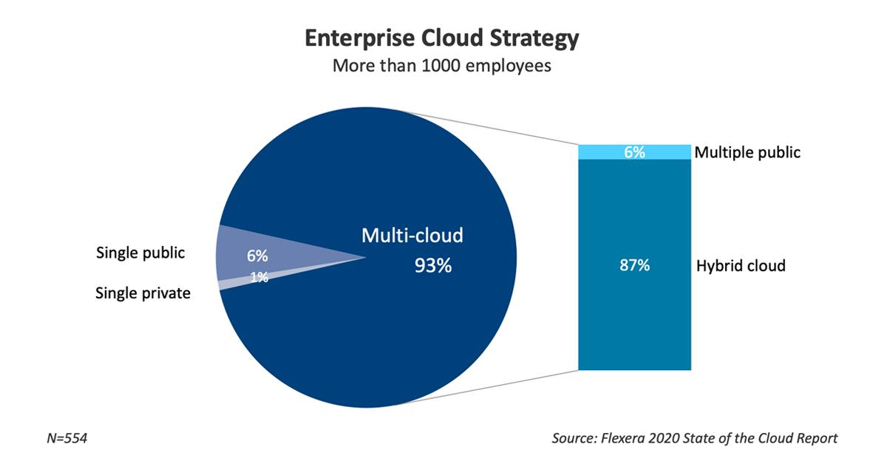
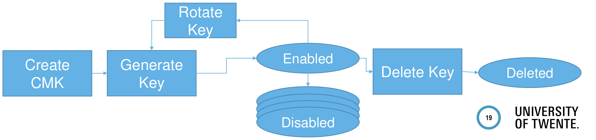

# Secure Cloud Computing - Unit 1

## Introduction and Key Management Service

What is Cloud Computing? According to the NIST's official definition released in 2011:

> Cloud computing is a model for enabling ubiquitous, convenient, on-demand network access to a shared pool of configurable computing resources (e.g., networks, servers, storage, applications, and services) that can be rapidly provisioned and released with minimal management effort or service provider interaction. 
>
> This cloud model is composed of
>
> - five essential characteristics,
> - three service models,
> - and four deployment models.

The five <u>essential characteristics</u> of CC are the following:

1. **On-demand self-service**: the user can access a kind of portal/interface to mount new resources if necessary;
2. **Broad network access**: available over the network (often the Internet);
3. **Resource pooling**: customer are pooling from the same physical resources, we have a single server shared between multiple users
4. **Rapid elasticity**: customers can increase/decrease resources as needed in a fast way;
5. **Measured service**: the customer pays for the used resources (increase the cost by increasing the computational power and vice versa).

There are three types of <u>service models</u>:

- **Software-as-a-Service**: [...] use the *provider's applications* running on a cloud infrastructure (e.g. games, emails).
- **Platform-as-a-Service**: [...] deploy onto the cloud infrastructure *consumer-created or acquired applications* created using programming languages, libraries, services, and tools supported by the provider (e.g. databases, exec. environments). The actual service is decided by the user itself.
- **Infrastructure-as-a-Service**: [...] provision *processing, storage, networks, and other fundamental computing resources* where the consumer is able to deploy and run arbitrary software, which can include operating systems and applications (e.g. VMs, storage, network).

In recent years this trend shifted from these three service models to EaaS: **Everything-as-a-Service**. The old definition is outdated and should be updated. 

Finally, there are four <u>deployment models</u>:

1. **Private Cloud**: exclusive use by single organization or customer;
2. **Community Cloud**: exclusive use by specific community (not so common);
3. **Public Cloud**: open use by the general public;
4. **Hybrid Cloud**: composition of distinct models.

Recently a study has been published on how the different deployments models are distributed: most enterprises (>1k employees) use the Multi-Cloud approach which means that they do not rely on a single model but adopt multiple ones combined.

We are looking into scenarios where data is outsourced and on this some computation must be done (<u>outsource computation</u>). The total market increases every year but typically the biggest issue with migration to cloud infrastructure is **security**.

When talking about Cloud Computing security, there are different attackers' classes:

- External adversaries that try to mount attacks on the communication. A protection mechanism is for example TLS;
- External adversaries that try to attack the cloud system. Some protection mechanisms include firewalls and IDS, monitoring and security measures adopted in the OS of both the host and the guest;
- Co-tenant adversaries which use the same cloud service as the victims. The possible countermeasures and mitigations are isolation, sand boxing, monitoring and the use of Hardware Security Modules (HSM).

### AWS KSM: Security Service in the Cloud

KMS stands for **Key Management Service**. This service is well documented and widely employed. It is heavily based on cryptographic tools.

By deploying the aforementioned service, Amazon promises the following benefits:

- *Fully Managed*: access control enforced by user while Amazon handles durability and physical security of the system;
- *Centralized Key Management*: single control point to manage cryptographic keys. This is the goal of the service;
- *Manage encryption for AWS services*: well integrated with AWS services;
- *Encrypt data in your applications*: via APIs even in your applications;
- *Digitally Sign data*: using asymmetric crypto, but secret key is stored in HSM (or is outsourced in an encrypted form);
- *Low cost*: charged by numbers of keys stored;
- *Security*: by hardware security modules;
- *Compliance*: via certifications to specific restrictions;
- *Built-in auditing*: requests are logged to CloudTrail (all requests for the keys are locked in that service);

The cryptographic tools (primitives) that are used in KMS are the following:

- **Random Bit Generator**: seeded with 384 bits randomness;
- **Symmetric Encryption**: AES-GCM 256. This cipher is an AEAD (Authenticated Encryption with Associated Data) so you cannot only encrypt data but also guarantee its integrity;
- **Key Derivation Function**: HMAC with SHA256 in counter mode;
- **Envelope Encryption**: the payload is encrypted with data key and at the same time the data key is encrypted with key encryption key. Its advantage is that a new key encryption key is generated for each encryption (if one of those keys is leaked, then only the last message can be decrypted and read in plain text) and additionally re-encryption is quite easy since it only requires to decrypt the key encryption key and encrypt it with a new one. Additionally, it improves fastness: the data key is symmetric and the key encryption key is asymmetric, only a very short asymmetric encryption phase is performed, only the key is encrypted that way, while the whole payload is encrypted with the symmetric scheme (hybrid encryption);
- **Asymmetric Encryption**: RSA with 4k bits keys;
- **Digital Signatures**: Elliptic Curve Digital Signature Algorithm (ECDSA);
- **Key Establishment / Exchange Protocols**: Diffie-Hellmann Key Exchange.

##### High level concept

Communication between Customer and Cloud is secured via TLS. Sensitive master keys are stored in **Hardware Security Module (HSM)** and never leave the HSM in plaintext. HSM enforces access policies for stored keys so that different tenants are separated by the HSM: a single HSM can manage different keys belonging to different customers.

Now the different keys involved in the process are presented.

The first one is the **Customer Master Key (CMK)** which in the case of AWS KMS it is a logical placeholder for a real key, the **HSM backing key (HBK)**. Different HBK versions then can be associated with same CMK ($HBK_1, HBK_2. . . $).

As claimed before, this sensitive key (HBK) never leaves the HSM in plain text but only the encrypted version is stored outside of HSM on highly durable storage. This encrypted version is called **Exported Key Token (EKT)**: encrypted HBK using HSM managed **domain keys (DK)**. Whenever the clients requires this key, they cipher text is loaded into the HSM, is decrypted using the domain key and then the actual key can be used within the scope of the HSM. 

How can we get the HBK into the HSM? And how can it be associated with the CMK? 

HBK can either be generated in HSM (fully relying on its security and on its randomness) or key material can be imported by customer using asymmetric cryptography.

Let's assume Alice has her own HBK that wants to outsource to the HSM:

- HSM generates RSA keypair;
- Public key is sent to Alice, secret key remains in HSM;
- Alice encrypts key material and sends it back to HSM;
- HSM decrypts key material and stores it as HBK (and associates it to the CMK).

##### Life Cycle

What is the life cycle of the CMK? There are different versions of HBK associated to the CMK so the question becomes, when do we disable one of them? 

CMKs can be <u>rotated</u>: disabled keys can still be used for decryption. This is particularly useful when using envelope encryption. When we rotate key we want cipher text to be still accessible so we keep the old versions of the CMK but do not use them anymore for encryption.

CMKs can be <u>deleted</u>: internally, CMK is completely disabled 7 days before actual deletion.

##### Key Hierarchy

CMK can be used directly to protect information or can be used to protect user-generated **Customer Data Keys**. We have one CMK and then different CDK for each service. And, as previously mentioned, there may be cipher texts encrypted with disabled HBK.

Customer Data Key can be used by customer to encrypt data on client side. The CDK is used for individual services. AES-GCM is an authenticated encryption scheme with associated data (AEAD) that will be used in this context. Authenticated data is called **encryption context** in KMS. It can be used to raise an additional check, so if there are different users of the service then we can associated the username as authenticated data and ensure that only the matching use can use the corresponding key. How do we generate a new CDK?
1. Retrieve EKT (Exported Key Token) from cloud durable storage;
2. Generate CDK (Customer Data Key) with RNG (Random Number Generator) on the HSM;
3. HSM decrypts EKT;
4. HSM generates random nonce N;
5. HSM derives AES key $K$ from $HBK_ i$ & $N$;
6. HSM encrypts CDK with K and context;
7. The cipher text is sent back to Alice and it is also sent back in plain text.

##### Encryption & Decryption

AWS KMS can also be used for encryption. Nevertheless, KMS is designed for manage keys not using them: you can only encrypt very small plain texts. Only encryption of 4KB plaintexts (e.g. app keys) is supported and it's like generating CDKs.
1. The client sends a plain text p to be encrypted (AWS is able to read all the sent plain texts);
2. HSM retrieves the EKT from cloud storage and decrypts it;
3. HSM generates random nonce N;
4. HSM derives AES key K from $HBK_ i$ and N;
5. Encrypt p with K and context and sends back the cipher text c.

Decryption is done in a similar fashion to encryption, just reverse. Key is reconstructed from nonce (part of ciphertext). 
1. Client sends cipher text c;
2. Retrieve EKT from cloud storage and decrypt EKT;
3. Retrieve N from ciphertext;
4. Derive AES key K from $HBK_ i$ and N;
5. Decrypt c with K and context.

Re-Encryption of a CDK or a ciphertext is possible from one CMK to another one (also, from an old version to a new version for the same CMK). Client sends a cipher text c, the decryption is done in the context of the HSM and then it is encrypted again. 

##### Domains

Domains are collection of internal AWS KMS entities within one AWS region (each region is separated by a logical construct, the domain). Domains have states defined by properties such as:

- Name;
- Secret keys (domain keys);
- Members (HSMs) and their public keys;
- Operators and their public keys;
- Rules.

**Domain keys** are set of keys shared by all HSMs in one domain. They are used to encrypted HBK before storing externally. Domain keys are rotated on a daily basis by Amazon internally (and generated by the HSM, the old versions are deleted). All EKTs (External Key Tokens, encrypted versions of the HBKs) are re-encrypted with new domain key every day.

This is fine when only one HSM is present, however, this is not the case (there are multiple HSM for redundancy reasons within one domain which share the same set of domain keys). For syncing, HSMs do not communicate directly but via operators sending **Exported Domain Tokens (EDT)** that represent the current domain state to all the HSMs. The HSMs load it and then they are synchronized. The protocol follows these steps:
1. Operator sends Domain Management Command;
2. New domain state is generated by one of the HSMs (and signed with its verification key) and exported as signed EDT;
3. Operator sends update command containing the EDT to all HSMs that are members of that domain;
4. HSMs separately authenticate command (check that it has been signed by a member of the domain) and domain token then apply it.

##### Rotating Domain Keys

Each HSM has two public keys:

- **HSM identity** (signature) key pair;
- **HSM agreement** key pair: asymmetric encryption key.

When rotating the domain key, one HSM generates new domain key and encrypts it with the agreement public keys of each HSMs and also its identity key. The signed EDT is sent back to the operator: the operator cannot read DK due to encryption.

Let's see the process more in details.

The agreement key pair for party $P_ i$ is a pair of Diffie-Hellman parameters:

- Public value $pk _{P_ i} = e ^{p_ i}$
- Private value $sk _{P_ i} = p_ i$

Then envelope encryption of domain key $DK _{i+1}$ is used to outsource it. The public parameter of DH is part of the domain state and is already known by the HSM that will be later asked to import the new domain state.

In order to encrypt the new domain key, we use a sample ephemeral secret key K and encrypt the domain key $Enc(K, DK _{i+1} )$. It samples a random DH private value $r$. Then for each HSM $P_i$ member of the domain:

- Calculate shared secret $SS _{IP _i} = (e^{ p _i})^r$ for each HSM
- Derive joint key $K _{IP _i} = KDF (SS_ {IP _i})$ (Key Derivation Function)
- Encrypt $C {P_ i} = Enc(K _{IP _i} , K)$

This is similar to public key encryption where you share public parameters for distributing something. This is repeated for each member of the domain state. This operation only happens once because the domain key is only one. 

Send $e ^r$ , $Enc(K,DK_{i+1}),\{{Enc(K_{AP_i},K})\}$.

Storing keys is really important, if you lose them, you lose the data. At the same time it is not recommended to store crypto keys in plain text because then everyone who has access to such keys, can decrypt the cipher texts making the encryption phase useless. In the first half of the lecture, how users can use such a service and which commands to derive keys, encrypt payloads and re-encrypt keys that are changed. The second part describes how Amazon tries to internally manage their landscape: key rotation, separation of domain, separation of operators.

Another handy operation for AWS is adding new HSMs. The underlying procedure is the same: there is the operator who distributes the new domain state which includes the new HSM that wants to join the current domain. 

A domain HSMs can be synced via exported domain tokens. The join operation is executed by an operator to add new HSM to domain state:

- Operator updates the domain state including the new public keys;
- New keys are synced via syncing protocol.

How can the new public keys be sent to all existing HSM so that in the next sync, the new member is also included? The operator does not need any secret info but it only sends the DH public parameters to the domain that is then synced.

There is one problem with this approach: malicious operator can infiltrate trusted members (the HSMs do not communicate directly with each other so they must rely on operators, they do not know the existence of each other) and perform MITM attacks: instead of syncing the right parameter the malicious operator can generate its own and claim those to be legit of a HSM. Then he can also reconstruct the domain key. To mitigate this problem, instead of one operator, multiple operators confirm each operation (**consensus**): for each operation, a list of quorum rules is defined in domain state and each operator has to digitally sign it. Only commands that fulfill a rule allow domain state changes. If only one operator is malicious then the previous attack cannot take place. Are the trust issues solved? No, if an attacker is able to corrupt more operators of the system, then the attack can still be mounted. However, it is hard to manipulate such a system. Unfortunately there is another class of attacks when considering Cloud Computing, quite powerful, which is represented by the NSA that can force Amazon to unveil the keys depending on where the data center is located.

~~operators == amazon engineers or security officers~~

##### Conclusions

There are a bunch of protection mechanisms in AWS KMS:

- Communication between customers and services via TLS
- HSM isolates keys of different tenants
- HSM protects key material against curious operator

At least that is what Amazon claims how it works!

- Trust in Amazon is still necessary.
- Trust in American Agencies is also necessary.

### Cloud Security against internal attackers

Some questions pop up when considering the main security properties related to cloud security:

- *Integrity*
  - How do I know that the cloud provider is doing the computations correctly?
  - How do I ensure that the cloud provider really stored my data without tampering with it?
- *Availability*
  - Will critical systems go down at the client, if the provider is attacked in a Denial of Service attack?
  - What happens if cloud provider goes out of business?
- *Privacy issues* raised via massive data mining
  - Cloud now stores data from a lot of clients, and can run data mining algorithms to get large amounts of information on clients. What do they do with all that stored data?

Of course, the attack surface is increased:

- Entity outside the organization now stores and computes data (they must be trusted), and so attackers can now target the communication link between cloud provider and client. Additionally, cloud provider employees can be targeted by phishing.

There are problems related to auditability and forensics too:

- It is difficult to audit data held outside organization in a cloud (cloud providers are quite reluctant to share info about their internal processes);
- Forensics are more difficult for clients since they don’t maintain data locally.

Finally, when thinking about confidentiality:

- Will the sensitive data stored in a cloud remain confidential? Will cloud compromises leak confidential client data (i.e., fear of loss of control over data)?
- Will the cloud provider itself be honest and won’t peek into the data?

The drawback of having another trust anchor in your system is quite severe and raises a lot of questions.

The scope of this course is to define cryptographic protection against semi-honest (honest-but-curious) clouds:

- Cloud provider follows protocol and does not deviate from it (risk of getting caught);
- Different scenarios, protection goals and cryptographic tools;
- Discuss different aspects: performance analysis, security proofs, use-cases and limitations.

To complement, an excursion into cloud security in the real world from end-user perspective.