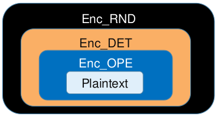
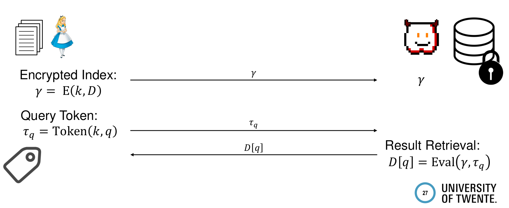

# Secure Cloud Computing

## Encrypted databases and searchable encryption

#### Database-as-a-service

The general problem that we are considering today is the one of **outsourcing a database** (intended as a collection of data), **without trusting the cloud provider**. We can encrypt the data and send it, but at some point we will need to retrieve some information to use them. This is not trivially possible.

Of course the easy solution is downloading everything and then search locally, but this is of course not very convenient. This is what is done quite often if you upload encrypted data and you don't adopt any strategy to access them in clear. Given the condition of using **less storage locally** then in the outsource context, we can follow two different approaches:

- **search data content directly**, by scanning each single file (no storage overhead, since you only store data itself, but search time linear in the size of data);
- **extract meta-data and create a db**, using a smarter data structure to complete operations (this needs to be updated and synced with data being uploaded, but is more efficient).

`CryptDB` (2011) is the first example of combination between **encryption** and **an SQL-aware database**. This allows people to use the main SQL features to operate on encrypted data. The key should never leave the client and the technology should be working out-of-the-box.

How does it work? Data is encrypted locally and then sent to the cloud service provider. Then the key must be stored and not leave the client, while data can be deleted. Whenever data is needed, SQL queries can be transformed and sent to the cloud, which will respond with an encrypted result set. Note: the cloud provider can still read the queries in plaintext.

How to do this from a crypto point of view? Using **property-preserving encryption**, meaning that some properties of plaintexts are kept in ciphertexts. We can have **deterministic encryption (DET)**, meaning that the same plaintext leads to the same ciphertext (with the same key). While normally this is not good, in this context we need this to be able to search over encrypted data. We can also have **order-preserving encryption (OPE)** that, as the name suggests, will preserve order relations in ciphertexts (5 will generate a somehow larger ciphertext than 4). There is no need to understand the details, just know that these encryption schemes exist in real world. With additively homomorphic encryption, also summation queries are possible.

What is basically done is that all the columns of the database are encrypted, using DET and/or OPE depending on the type of queries that we will need to run. Then the database will work normally, e.g.:

`SELECT * FROM Deals WHERE Customer = Smith` 

becomes

`SELECT * FROM Deals WHERE Customer = E(Smith)`.

Problem: the more you add "features" to your ciphertext, the more information you are leaking. E.g. OPE vs DET, one reveals order, the other allows equality checks. To tackle this, we can use **onion encryption**, named after the layered design. Once you need the given functionality, you peal the onion.

Practically this is done by **sending keys** to the cloud provider and decrypting the database entirely, layer by layer. The advantages of this model consist in storing data only once, since there is no need of having a column per encryption scheme, and that "quality" data is unveiled only when necessary. Further operations can be determined by the model of trust of the cloud provider (e.g. re-encrypt data, leave it with the lowest encryption layer once revealed). In fact, a malicious one can take a copy of data as soon as they are available, so there is no need to re-encrypt them. Thus, what is the ultimate reason for applying this random encryption layer in the end? As a database designer, you don't know how queries will look like, so it is better to start with the strongest encryption scheme. 

##### Attacks on CryptDB

We have just seen the shortcoming of this approach. Complete structure of plaintext is revealed at the first query: this of course helps with indexing, but we don't want the attacker to access that info. Leveraging on **background knowledge**, an attacker can reconstruct the content of the database even if it was encrypted. In 2016, a paper was published that showed for the first time how to effectively attack CryptDB. Very simply, it is enough to sort the known distribution of data and generate a histogram for that, which will reveal information when compared to a histogram generated from the database. The most frequent value from the known distribution will map to the most frequent ciphertext and so on.

Another attack is possible against OPE, assuming a **dense dataset** as plaintext, simply consists of mapping the values to the ciphertexts according to their order.	

To conclude, PPE is still being used nowadays, since it is so easy to adopt in DBMS. However, OPE is not used because there is no standard scheme to do that and because it leaks more than DET. Security is debatable as we have seen, because if an attacker has background info they can reconstruct a lot of stuff.

#### SSE

Instead of PPE, that unveils data after the first queries, the ideal solution would use **randomized encryption** but would still allow us to run some functions. This can be realized with **functional encryption**. The idea is to use randomized encryption, but the client can use a **function token** to generate a token, send it to the cloud and let it evaluate some queries. This evaluation function guarantees security to the values that have not been evaluated, but causes a bit of performance loss.

Remember **pseudorandom functions (PRF)**: a recognizer cannot distinguish the difference between the generated numbers and true randomness. First example of searchable encryption was published in 2000 (11 years before CryptDB!). You can encrypt with a quite simple procedure, adding randomness to avoid determinism. The steps are as follows:

- Generate a random key $K$;
- split the document to encrypt in several keywords ($p_1, ..., p_n$);
- for each $p_i$:
  - use the PRF to calculate $\tau_{p_i} = F_k(p_i)$;
  - generate random value $l$;
  - use the PRF to calculate $F_{\tau_{p_i}}(l)$;
  - the final ciphertext is $c_i = l\ ||\ F_{\tau_{p_i}}(l)$.

As you can see, this encryption scheme ensure non-determinism, thanks to the random value $l$. Data encrypted in this way can be sent to the cloud provider and it will not be able to build any histogram out of it.

How can you search on data instead? You can get the search-token again, by using your key ($\tau_{p_i} = F_k(p_i)$); then, you send it to the cloud and the provider will try recomputing $F_{\tau_{p_i}}(l)$ for each entry, checking if it matches the second part of the ciphertext. There is no way to decrypt in this simplified version: however, it is normal to consider searchable encryption only with the purpose of retrieving data from a remote database; then you can still use this method to handle already encrypted data (with a super secure AES) as plaintext, that in this way can get indexed. 

##### Structured encryption

Structured encryption takes a step forward with respect to functional encryption. Instead of considering each plaintext individually, structured encryption takes a full data collection and together with the key it generates an **encrypted search index**. Similarly to the previous case, it is possible to generate a token and retrieve some results, that are not complete data, but extracted keywords that can point to the right encrypted payload to be downloaded and decrypted afterwards.

The first idea of this document index was introduced in 2005. It consists of having a plaintext dictionary with some keywords $U = {p_1, \dots p_m}$ and a set of documents $D = {d_1, \dots d_n}$ containing these keywords. The cloud provider knows the underlining universe, so the first step is the application of a permutation function to the initial dictionary, so that it will be no longer possible to understand at which position the corresponding ciphertext resides. Then, for each document, a bitarray is created, indicating whether the keyword is contained in the document. After that, these bitarrays are encrypted with two pseudorandom functions $F$ and $G$, one using a new key $K_2$ and the other using the result from the first as key. The importance of $G$ is the fact that it makes the bitarrays vary between different documents. Finally, the second value is xored with the initial bit of the array, creating a new bitarray (for each document), that is sent to the server. In formal steps:

- Permute dictionary using pseudorandom permutation $\prod$ and key $K_1$:
- For each document $d_j$, create bitarray $I_j$;
- For each document $d_j$, set $I_j[\prod_{K_1}(i)] = 1$ if keyword $p_i$ is in the $d_j$, $0$ otherwise;
- For each bitarray $I_j$:
  - $r_i = F_{K_2}(i)$ for each keyword;
  - Set $E_j[i] = I_j[i]\ \oplus G_{r_i}(j)$;
- Send each $E_j$ to the server.

To search on this index, calculate the permuted index $\pi = \prod_{K_1}(i)$, then calculate the token as $F_{K_2}(i) = \tau$ and send $\pi, \tau$ to the server. As a response, for each document, the server will reverse the masking operation (reverting the XOR) and return the bit at the index of the keyword we are looking for. 

*In the end, the server sees the real bitarray with enough queries. Why are we doing such complex operations then, if ultimately the server will read the unmasked values? Can't we leave them as they are instead of going with XOR, PRF etc? Maybe because we will never do so many queries to unveil the whole bitarrays?* 

Talking about performances, the first solution is linear in the number of encrypted keywords (it needs to search a match in every generated chunk). while the second is linear in the number of files (it needs to access each bitarray). The former is definitely not good, as usually you want to store **big data** in the cloud and you have a lot of keywords. The latter is better, but the best would be depending only on result set size.

In order to achieve the optimal performance, we need to build a **reverted index**, as proposed in [CGK+06]. We can create a dictionary with the keywords as keys and documents as values. This dictionary can be implemented as a hash table, hence access costs constant time. The idea is that you have this hash table giving the entry point for the keyword, then you build this large scrambled array with embedded linked lists that underline the lists of the various keywords. 

More concretely, the index can be constructed in the following way:

- create dictionary with keywords as keys;
- for each keyword, compute a result set;
- build encrypted array containing result sets in permuted order:
  - for each keyword $w_i$, generate initial key $K_{i, 0}$;
  - for each document $D_j$, containing keyword $w_i$:
    - generate key $K_{i, j}$;
    - create node $N_{i, j} = <id(j)\ ||\ K_{i, j}\ ||\ \psi_K(ctr + 1)>$ (i.e. \<identifier of $D_j$, key for the next cell, position of the next cell>);
    - final array is $A[\psi_K(ctr)] = E_{K_{i,j-1}}(N_{i,j})$, so save every node at permuted position, encrypting it with the previous key.
- to build the inverted index for keys and entry points:
  - permute lookup table using PRP (so the adversary does not know which cell corresponds to which keyword);
  - encrypt each table entry as $<index_A(N_i, 1)\ ||\ K_{i, 0}> \oplus\ f_K(w_i)$, representing the index of the first result for keyboard $i$ in the array $A$ and the key to decrypt it;
  - fill the table respecting the permuted positions.

Searching at this point is straightforward: we first reapply the permutation to access the right position of the table, then we decrypt the value and we traverse the linked list within the array, always decrypting with the last key received. With this solution, nothing is leaked for non-queried keywords.

How can you proof that this actually works and that it has the properties that we mentioned? First of all, we need a framework to analyze these encryption schemes: we can no longer use the idea of chosen-plaintext et simila, because we are in a scenario in which the attacker learns about our data progressively. What is usually used is a "security game" in which you have a distinguisher and challenger. The former sends messages to the latter, which can communicate with two "boxes", representing the real protocol and the simulated protocol. When communicating with the real protocol, the challenger sends real data collection and queries and receives encrypted index and tokens; when communicating with the simulated one instead, it sends data collection leakage and queries leakage - determined by a special leakage function that we will see later, that replies with simulated index and token. Finally, the distinguisher needs to understand if the challenger talked with the real or simulated protocol. The distinguisher can work in adaptive or non-adaptive way, that is, receiving data on multiple (and potentially optimized) iterations or just once at the beginning. The former is obviously more powerful than the latter.

How are leakage functions defined then? The proof the security of a schema is bounded to this leakage function, which needs to be defined and represents a constraint. Common functions for data collection leak the number of documents, the length of each document or the number of keywords, while the ones for query leakage can reveal patterns in search or access. These common leakages are not universal and they depend on the underlining protocol. Every protocol is usually proven with different functions and it cannot be said that one is better than another.

Then, the security proof is defined as follows:

> a protocol is secure, if the distinguisher has negligible chance to decide what box has been chosen by the challenger.

The proof is conducted with these steps:

- declare the leakage function to be used;
- construct a simulator for the protocol with that function;
- prove that a distinguisher has small probability to distinguish, using cryptographic reduction (i.e. with leakage underlining crypto can be broken). 

This might be quite unclear, so let us have a practical example or a security proof. We want to proof non-adaptive security of the reverted index model. We define the leakage function on data collection ($L_1$) as both the number of documents and the number of distinct keywords. This is quite intuitive, since the number of documents is exactly the number of encrypted payloads sent to the cloud, while the number of distinct keywords is the number of keys in the index dictionary. Then, the query leakage function ($L_2$) allows the attacker to see the matching document IDs and the same search queries. Intuitively, this does also make sense: given the construction of the protocol and how it does encryption, these details can be leaked. Finally, the claim is that (note that it is dependent on leakage functions):

> If:
>
> - $\pi, \psi$ are pseudorandom permutations,
> - $F$ is a pseudorandom function,
> - $E$ is a real-or-random secure encryption function (i.e. you cannot distinguish a real ciphertext and a ciphertext of a random value),
>
> then [CGK+06] is ($L_1, L_2$)-secure against non-adaptive adversaries.

We build the simulated protocol with the following steps.

- Initialize empty array $\tilde{A}$;
- For all sets of documents in access pattern leak and all the queries in search pattern leak:
  - Generate initial query key;
  - Randomly fill the array with encryptions of matching IDs (same as original protocol, but cells are randomly positioned);
  - Fill the rest with random values.
- Build a lookup table and fill it with values similarly constructed, but with random components to substitute unknown data.

At this point, how can the distinguisher spot the difference between the two boxes? With the arrays, in the real protocol we use PRF and PRP with the real indexes, while in the simulated version we go directly with random positions. This cannot be distinguished, since we are assuming that our pseudorandom primitives are reliable. Same happens with the actual content of the array. The same situation is repeated with the lookup table: to break our scheme the attacker would have to break the underlining cryptographic functions, which are assumed to be secure. Finally, also tokens contain a random component in both cases, so the simulated ones cannot be spotted.

To sum up, a security proof starts from the definition of leakage functions, then the creation of the simulator and finally it is completed by showing that the distinguisher cannot successfully find out which protocol the simulator has communicated with (and why). 

We have now proved non-adaptive security, which is easier, because the simulator knows the access pattern for all queries during the index simulation. With adaptive security instead, we would need to change leakage assumptions and give access to all indexed keywords in the data collection leakage (hence resulting in nothing better than deterministic encryption), or using as cryptographic base a programmable random oracle model.

