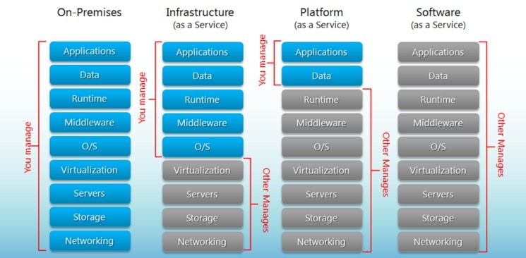
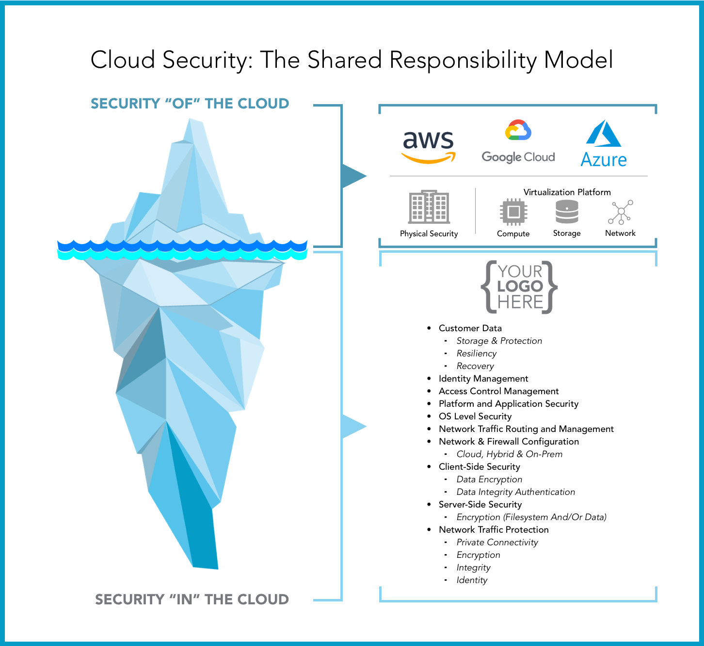

# SCC 4

## Cloud security from an end-user perspective

Cloud security started to become a hot topic from 2009 on. Why? The big cloud providers launched they services in 2006 (AWS), 2010 (Azure) and 2013 (Google Cloud). These are just the big ones (the 4th one is Alibaba): Jair, who has a couple of computers at home, can claim that he has his own cloud and everyone can access. Even if not everyone can access it, still it can be called a "private cloud".

Who is the responsible for security in the cloud? After some troubles right at the beginning, nowadays AWS (and other big players) adopted the **shared responsibility model**: the customer needs to take care of the **security <u>in</u> the cloud**, while the cloud provider ensure the **security of the cloud**. This means that AWS makes sure that the hardware and software running on their site is secure against physical attacks or other hackings, while they are not liable for a customer who loses an encryption key or leaks some of their data (e.g. passwords in plaintext in a document). Things start to get complicated when talking about more peculiar things, e.g. who is responsible for the operating system? It depends: if the customer is using/hiring a VM is theirs (still the cloud provider will send notification if the OS has a old version no more secure), while if they load a file on a cloud storage it is the provider's. However, in the first case the provider can also provide support and guidance for example ensuring that only up to date software is being run.

To improve the distinction of the various cases we can introduce the difference between IaaS, PaaS and SaaS. Some examples: Dropbox is SaaS (the server is running in the cloud, you know nothing), Microsoft Office Online is SaaS (like Dropbox), a VM is IaaS (you decide whatever you want to do at OS level, it is not a PaaS since it has at least one runtime, the Java's one). An example of PaaS can be Google Cloud Functions, while Docker and Kubernetes are kind of in between IaaS and PaaS (you can decide a specific OS, or you can just ask for an image and do something with it).

Focusing again on security, "thing" as a Service can be distinguished with a bit more difficulties, sometimes it really matters to do what users are really doing with resources and the security responsibility is in between the provider and customer. Referring to the nice iceberg slide, very often the security of the cloud (ensured by providers) is just the upper part and there is a lot below the sea level.

Academia can focus on both security of and in the cloud, but we will focus on the latter. Another example: who is responsible for **data encryption and security**? In a docker-like case, customers are fully responsible, while in Dropbox we can assume a good level of security against attackers. However, Dropbox can still see the customers' data in clear! The bottom line is: by looking at these various example, we can come to the conclusion that responsibility is usually shared among provider and customer, but from an end-user perspective it can make sense to add an additional layer of security, to protect themselves further.

Against who are they protecting themselves though? The old cyber kill chain is not accurate for the cloud. The **MITRE** framework identifies different tactics and techniques, leading to endless procedures (e.g. which tools are used, their configurations...) and it is open to new contributions. There you can find also tools, detection procedures and so on. It is a nice starting point to understand risks for different scenarios. Also, we can use the unified kill chain to model attacks as just cyclic actions happening to complete the actual hack. All these tools are not specifically to the cloud but can be used also for other kind of attacks.

- 176/184 techniques are applicable to Windows
- 41/184 techniques for the cloud (but we then need to take into consideration also what we have in the cloud, not only its infrastructure), this is not the full picture
- Azure AD (Active Directory): credentials. Identity is a key element because typically every service needs to be accesses through some usernames and passwords.

Another useful resource is the **CVE** database, which are basically related to software versions (e.g. vulnerabilities of older versions that should have been patched). The idea of a CVE is to highlight a way that an attacker could use to break into a system and rise awareness in the community.

In order to detect attacks and defend systems, one of the most effective techniques is using data. Not restricted to cloud architectures, defenders can use firewalls, logs, ids etc. Is there a new attack surface that the cloud adds? Mainly the identity: the processing and the other things you use don't differ from the local scenario. When it comes to hybrid deployments, often times security decisions are taken based on the price. The cloud adds flexibility and resources, but then each customer decides where to place end-points, data etc. especially taking into consideration money.

Security Information and event management (SIEM), evolution over time. Many times tools are running on premise, not really on cloud: defensive infrastructures for companies are often like Frankenstein. SIEMs are basically big data analysis tools focused on security. Parameters differentiating them are about flexibility, expressiveness, quality of rules, accuracy, signature/anomaly based... In dealing with this huge amount of data machine learning is a powerful solution and it is also where academy should push to find good solutions.

Typical questions at an exam are:

* who is responsible is certain cloud architectures;
* against what should you defend;
* how do you detect and mitigate a specific type of attack.

For the assignment, each pair needs to implement 5 techniques on Azure, that is create and account, create a few VMs, preforming monitoring, launch attacks, show that the monitoring worked. 2 weeks deadline from Monday 5th.
