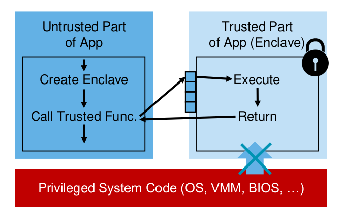
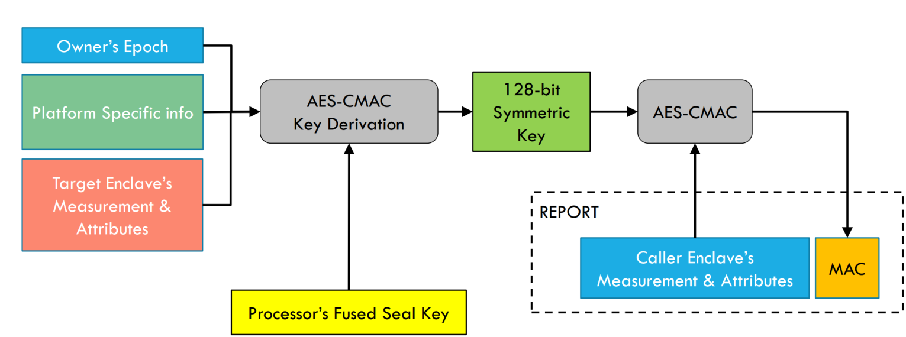
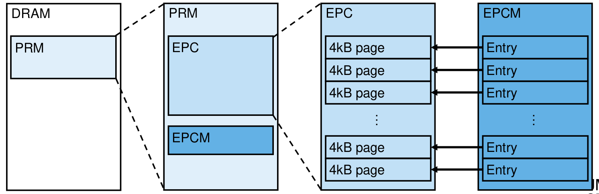
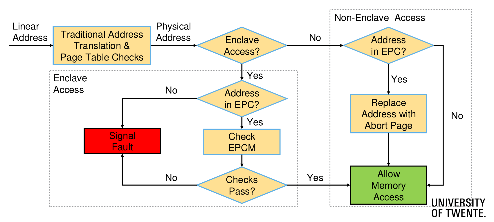

# Secure Cloud Computing - Unit 6

## Hardware-aided Computation over Encrypted Data

#### Trusted Execution Environments for Cloud Computing

After Jair's digression, we are back to the scenario in which we have a client and a cloud service provider that we don't trust. We encrypt the data before communicating, taking the measures we have already seen. In this lecture, we analyze the case of a cloud provider with a **trusted hardware component** that they cannot tamper with, nor they can access what is happening within this module. More specifically, what happens is that the cloud service provider stores encrypted data; then, this data is decrypted *within* the trusted piece of hardware, operations are performed over the plaintext; data is re-encrypted again and encrypted results are sent back to the customer. As a result, given the assumption of the inviolable trusted execution environment, the cloud provider cannot leak any information. 

This TEE has some requirements:

- be able to run code defined by the user;
- data confidentiality, no leak of data processed inside the piece of hardware;
- code integrity, the attacker cannot modify the code being executed;
- attestation, the user should be made sure that what they have uploaded as code is indeed running (differently from above, where we simply state that the attacker cannot tamper with the code, here we require a proof that our code is actually running);
- remote provisioning, allowing the user to transfer data and deploy code securely towards the TEE;
- data sealing, i.e. data stored in a non-volatile way preserving confidentiality and integrity.

In a regular scenario, we can make sure that apps are protected from malicious apps thanks to some rings dividing them, managed by the OS. A malicious app needs to exploit a vulnerability to control the privileged system code and thus break the other apps. In a cloud scenario, instead, we have sensitive layers in many places, the attack surface is large. The aim of Intel SGX is reducing this attack surface, by having less components to trust (actually only having to trust a small piece of hardware). Moreover, to achieve so it relies on a general purpose CPU, hence without requiring the presence of special modules.  

#### Intel SGX

SGX stands for Software Guard Extension. Intel introduced it in 2015, with the Sylake CPU generation. The key concept is the **enclave**: a protected environment containing code and data for sensitive computation. A system can support several enclaves, isolated from each other and from untrusted software, concretely allowing multiple application running securely. SGX is a feature available in current Intel CPUs and to use it it needs to be supported by the BIOS and enabled. 

There are three key concepts for the security point of view.

- **Isolation**: each enclave is within the hardware in a guarded area, no wait to extract information from them (not even with physical access).
- **Sealing**: data is protected also when being written in untrusted storage and can be altered only by the same (or updated) enclave.
- **Attestation**: local (between two enclaves on the same platform) and remote (between enclaves and third party outside the platform).

When developing applications that will be using SGX, there is an important division to do: a part of the application can be trusted (so it will be executed in the enclave), while the other part will be untrusted. As a design principle, the enclave should be as small as possible, because of number of reasons. First, in the current version of SGX, the code supported is limited in size (~128 MB); second, given the performance issues when switching between trusted and untrusted part, these switches should be limited as much as possible. Concretely, the untrusted part can use a number of different functions to move to the trusted part and execute some code, which will return some result.

**Data protection** works as follows: the processor reserves memory (in the dynamic RAM) and protects it with crypto primitives, also against reply attacks. That means it is not possible to use content previously stored to deploy an attack. Data is decrypted inside the CPU and it stays decrypted only within the CPU. In other words, we fully trust what happens inside the processor, while several measures are taken outside of that scope. Among them, SGX performs access control to only let the enclave read/write the dedicated memory.

As for **data sealing**, enclaves are stateless, therefore everything is lost when they are destroyed. We need a way to store information (e.g. keys) securely in persistent storage. To save these keys in untrusted storage, data is encrypted in the enclave, then it can be stored in untrusted memory and can only be decrypted again on the same system. There are two possible approaches: the sealing key can be specific to the enclave and system, or it can be bound to the developer and the system, in such a way that data can be unsealed by later versions of the enclave.

In order for this to work smoothly, there is a solid cryptographic structure. In fact, in the very moment in which keys are stored in untrusted storage, they are exposed to the attacker, who could potentially retrieve them, decrypt data and complete the attack. The idea of key generation is that we start from an initial key (inside the processor) and we apply a Pseudo-Random Function a number of times, inside a loop. The number of loops needed to obtain the key for version `x` is `SVN.MAX - x`, where `SVN.MAX` is the number of versions that can be generated. Then we encrypt data with the generated key and we save the enclave version number. When it is time to decrypt the data, the very same process is applied again by the CPU, thus it re-generates the right key. Note that it always possible to calculate keys for older versions of the enclave (because it is enough to re-apply the PRF as many times as needed), while it is very difficult to go the other way around.

From a cryptographic perspective, **attestation** is the most interesting aspect. There are two possible flavors: **local** or **remote**. Local attestation is used when there are two or more enclaves in the same system. In particular, it allows the attesting enclave to demonstrate to the target enclave that it is running a specific code with a specific set of data. This is proven over a so-called *measurement*, which is simply a cryptographic hash of code and data. The process makes use of a **Report Key**, bound to each enclave, and is done as follows:

- the attesting enclave (so the one that needs to prove its content) generated a **report**, composed by the enclave's attributes, measurements and data from the user;
- the attesting enclave uses to target's Report Key to calculate a MAC of the report;
- the CPU transfers the report and the MAC to the target enclave, which regenerates these data;
- finally, the target enclave verifies that the report is valid.

The attesting enclave must be aware that it is asked to prove to another enclave that it is running the expected code because it is the attesting enclave the one starting the whole process. In the schema below we can observe how the report is constructed. Note that each report is built specifically for the target enclave, since it uses some data coming from there. Also, note that the enclave used a fused key, which is included in the CPU during production. The process of check is then simple, the target enclave regenerates the data and compares them to the report: if they match, the enclave is attested, otherwise there is something wrong.

Remote attestation is instead used when we have a client deploying a remote enclave and we want to make sure that the enclave is executing the code it should execute. The first step is pretty much the same of local attestation, thus generating a REPORT. This REPORT is transformed to a QUOTE by a Quoting Enclave (a special enclave part of each SGX enabled CPU, deployed by Intel, after local attestation). This enclave has a signing key, used to sign the REPORT thus transforming it into a QUOTE. This QUOTE is then sent to the client and verified with the Intel SGX server. In detail, Intel has a huge register for each CPU where the public key in stored in the register and it used to verify the code. After verifying the QUOTE, the client also verifies the REPORT itself. After this process, we also have an authenticated channel, therefore we can transfer a key and communicate securely.

The setup phase is long and it involves some steps done directly by Intel, when producing the CPU. In fact, the manufacturer fuses the Seal Key and the Provisioning Key in the processor, then it creates the provisioning enclave and there is also a step of attestation against intel provisioning service. The whole process is utterly complicated and the infrastructure is problematic. Part of this infrastructure is run by Intel, thus you must be sure that these parts are kept up and running all the time (essentially forever). Trust (about both confidentiality and availability) on Intel is central. Within SGX it is not possible to do I/O (thus this must be done by the untrusted part of the application), memory space is restricted and paging is only possible on Linux machines. This is not that much of a problem anyway, considering that the majority of servers in the cloud indeed runs Linux. From the security point of view, there are also side channel attacks possible, but Intel claims that these are outside of the threat model.

There is lots of research going on around Intel SGX, it looks very promising, but there are not so many practical applications. Restrictions are important and so are assumptions, so only the future will tell us how this technology will develop.

Really only out of curiosity, slides presents some instructions to develop SGX applications. We are not expected to know any of these details.

What is quite interesting is how the memory is composed when applications are using SGX. The enclave contains code and data, which are protected, supports threads and has full access to the application's memory. The picture below gives some indications on how the regions are actually composed. The various names are:

- DRAM (Dynamic RAM);
- PRM (Processor's Reserved Memory), reserved region in DRAM;
- EPC (Enclave Page Cache), contains enclave's code and data in pages of 4 kB;
- EPCM (Enclave Page Cache Map), contains meta data about the EPC.

Given that the memory is the same for everyone, there is an access control system to make sure that only allowed processes can access enclave section. The flowchart below well summarizes the steps.

Context switches have different kind of performance overhead. Keep in mind that SGX cannot perform system calls, so no network access or disk access (this needs to be done in the untrusted part). Context switches might cause interrupts, so appropriate measure need to be taken when leaving the enclave. Also paging requires a significant overhead, in case of large data. Taking a look at performances, we can see that the run time grow dramatically when the allocated memory size increases, first because cache cannot be used and then because of pagination. 

#### Possible applications

Once you have an SGX system, what can you do? One application is **SCONE**, which proposes to deploy docker containers within SGX. To do so, the idea is that part of the container (application code, libraries and some SCONE structures) are included in the enclave, thus making all of that trusted. These structures are called shields and they enable authentication and/or encryption for files, protected network and protected console channels. SCONE also features a complicated threading model, with enclave threads mapped to OS threads. Finally, thanks to shared memory, the number context switches can be reduced and threads inside the enclave are not directly needed to exit it for system calls. The figures on performance highlight that to write SGX programs it is not enough to just copy the normal versions with the new libraries, but also a thorough design phase is required, in order to adapt the program to the new context. 

Another interesting application is **IRON**. In their paper, they translate Functional Encryption in an SGX scenario, also adapting oracles etc. Remember that searchable encryption is a particular instance of Functional Encryption (where the function can be "equals a keyword"). It can be implemented way faster with SGX. To do so, they deploy different enclaves in different actors. The infrastructure is fairly complex, but the main points are schematically shown in the slides.