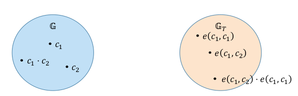
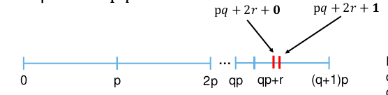

# Secure Cloud Computing - Unit 7

## Computation over Encrypted Data

### Functional Encryption (FE)

The setting is always the same, we have a client A and an untrusted Service Provider (SP). A wants to outsource data to SP without leaking the plaintext, so she encrypts the data and uploads only ciphertext.

The idea with FE is that A can generate a function token, transfer it to the SP which uses it in combination with the ciphertext to evaluate the function on it. The plaintext result is sent back to A. Given that the result is plaintext, it is leaked to the SP (e.g. we can leak the access pattern). 

The function token can be only generated with the client's secret key, hence the SP cannot do anything with the ciphertext only. The function token generation represents a sort of authorization to compute over encrypted data.

### Multiparty Computation

Multiple parties want to compute a program over joint data. We have two clients, A and B, and they both have sensitive data they want to outsource, hence they encrypt those and outsource to the SP. The SP can evaluate the program over the joint inputs from the different parties.

In contrast to FE, we have an interactive setting. The SP can interact with the parties and later perform the computation. 

It is important to distinguish between an online and an offline phase:

- online: interactive communication takes place;
- offline: before the outsourcing of data.

This can be generalized to $>2$ parties.

### Homomorphic encryption (HE)

The initial setting is the same: client A encrypts data before outsourcing to the SP. In contrast with FE, the Cloud SP can perform an operation on his own without the need of a function token and then return the **encrypted** result back to A (hence no leakage). 

We can imagine HE like a “normal” Public Key Encryption scheme, composed by the standard functions.

- $Gen (1 ^λ) $: generate and output public key $pk$ and secret key $sk$.
- $Enc (pk, m) $: encrypt message $m$ using $pk$ and output ciphertext $c$.
- $Dec (sk, c) $: decrypt $c$ using $sk$ and output plaintext $m$.

On top of that, we add a function for computation over ciphertext.

- $Eval (P, c _1 , ... c_ n )$: evaluate program $P$ over ciphertexts $c_ 1$ to $c_ n$ as program inputs. Output ciphertext $c′$  which is the ciphertext of the result evaluated over the input ciphertexts.

We can imagine PKE like a post box: everyone can throw letters but only the ones with the keys to open it can access the messages. To extend this to HE, we can refer to a gloves box: you can still work on the things inside but only the one with the keys can take out the result.

What is the theoretical definition of security we can achieve with HE schemes? We recall Indistinguishability under Chosen Ciphertext Attacks (IND-CCA(2)). Then can HE reach this level of security? Spoiler: NO. To understand why, we should briefly describe how this security game works: we first generate the keys, the $pk$ is given to the Distinguisher. The Adversary A generates two messages, $m_0$ and $m_1$ and sends them to Challenger which encrypts only one of them and sends back the result $c^*$ to A. A has to guess which one has been encrypted. A wins the game if they guess correctly. 

In IND-CCA settings, we have a sort of box that decrypts using $sk$ that the adversary can query to recover the  underlying plaintext. To make this game not trivially winnable, we won't decrypt the challenge ciphertext $c^*$. 

One attack strategy for an adversary to always win the game is to come up with another message $\tilde m$ so that $f (m_ 0 ,\tilde m) \neq f(m_1,\tilde m)$. Then what A can do is to ask $Eval(f, c ^∗ , Enc(pk, \tilde m))$ to the decryption box. Given that the result is different from $c^*$, the box computes $f$ and returns the plaintext result $f(m _b ,\tilde m )$. Since this result is different for the two messages, then A can only compute $f$ over the same arguments and understand which of the two messages has been chosen as $m_b$. 

#### Different flavors of HE

Different approaches to represent the program $P$ (or function $f$):

- *Numerical ciphertexts*, the program is represented by a multivariate polynomial with ciphertexts as input (used to evaluate the polynomial);
- *Bitwise ciphertexts*, the program is represented by a circuit with ciphertexts as input (encryption of a bit).

Both of them can compute any kind of function with an high enough degree or deep enough circuit.

Programs have different computational power supported:

- **Partially HE**: allows to evaluate the circuit or polynomial with only one operation (Multiplication, bitwise XOR); Examples are: ElGamal, (Textbook) RSA and Goldwasser-Micali;
- **Somewhat HE** (SWHE): arbitrary number of one operation, limited in the other operation, i.e. polynomial evaluation of a limited degree and binary circuit of a limited depth; Example: Boneh-Goh-Nissim [BGN05];
- **Leveled HE**: like SWHE but the number of limited operation depends on input parameter;
- **Fully HE**: Arbitrary number of both operations. Examples are: Gentry’s Lattice based scheme 2009, FHE over the Integers [vanDeijk+10] and Brakerski-Gentry-Vaikuntanathan (BGV).

#### ElGamal

This is the most simple HE scheme. Recall that a cyclic group $\mathbb{G}$ of order $n$ has the following properties:

- It has $n$ different elements;
- The group is equipped with a group operation $⋅$;
- There is one neutral element $1$;
- Each element $a$ has an inverse element $a ^{−1}$ such that $a ⋅ a ^{−1} = 1$;
- There exists at least one element $g ∈ \mathbb{G}$ that generates the group, i.e. $\{g^i : 1 ≤ i ≤ n \}= \mathbb{G}$;
- For every element it holds that $a^ n = 1$.

We will discuss multiplicative HE schemes (not the additive ones). The scheme can be built with the following four algorithms:

- $Gen (1 ^λ) $: Select generator $g ∈ \mathbb{G}$ of order $q$, pick random value $x$ and compute $h = g ^x $. Output $pk = (\mathbb{G}, g, q, h)$ and $sk = x $. Here it holds the Discrete Logarithm assumption hence, $x$ cannot be computed given only $h$ and $g$. 
- $Enc (pk, m) $: Pick random $y$, compute $s = h ^y = g ^{xy} $. Compute $a = g^ y$, $b = m ⋅ s$ and output $c = (a, b) $. In this context, $m$ must be a member of the cyclic group as well.
- $Dec (sk, c) $: Compute $s = a ^x = g ^{yx}$ and its inverse $s ^{−1 }$. Output $m ′ = b ⋅ s ^{−1 }$.
- $Eval (×, c _0 , c_ 1 )$: Multiply ciphertexts component-wise (for formulas refer to the slides). Output $(a ′ , b ′ )$.

In ElGamal, homomorphic operation depends on underlying group.

#### Boneh-Goh-Nissim (BGN)

BGN works in an extension of cyclic groups: bilinear groups. Bilinear groups have the following properties:
1. $\mathbb{G}$ and $\mathbb{G}_T$ are two multiplicative cyclic groups of finite order $n$;
2. There exists a bilinear map $e: \mathbb{G} × \mathbb{G} → \mathbb{G} _T $: for all $u, v ∈ \mathbb{G}$ and $a, b ∈ \Z$, it holds $e (u^ a , v ^b) = e (u, v )^{ab}$ for the bilinearity property;
3. As a consequence of bilinearity, given a generator $g ∈ G$, it holds that $e (g, g)$ is a generator of $G_ T$;
4. The pairing (i.e. mapping) can be evaluated efficiently (non-exponential).

The scheme works as follows.

- $Gen (1 ^λ) $: pick random primes $p$, $q$, compute $n = p ⋅ q$. Pick two random generators $g, u ∈ \mathbb{G}$ and set $h = u^ q$. Output $pk = (n, \mathbb{G}, \mathbb{G}_T , e, g, h)$ and $sk = p$; mind that $h$ generates a subgroup given that $h^p=g^n=1$.
- $Enc (pk, m) $: pick random $r$ and calculate $c = g^ m h ^r$. Output $c$.
- $Dec (sk, c) $: compute $c^ p = (g ^m h^ r)^ p = g ^{pm} h ^{rp} = (g ^p)^ m (g ^{pq})^ r = (g ^p)^ m$. Output discrete logarithm of $(g ^p)^ m$ to base $g^ p$.
- Evaluation over BGN-ciphertexts:
  - $Eval (+, c _1 , c_ 2 )$: Compute $c_ 1 ⋅ c_ 2 = g ^{m _1} h ^{r_ 1} ⋅ g ^{m _2} h ^{r_ 2} = g ^{m_ 1 +m _2} h^{r _1 +r_ 2}$
  - $Eval (×, c_ 1 , c_ 2) $: Compute $e (c_ 1 , c_ 2) = e (g ^{m _1} h ^{r_ 1}, g ^{m _2} h ^{r_ 2}) \\= e (g ^{m_ 1} , g ^{m _2}) e (h ^{r _1} , h ^{r _2}) = e(g,g)^{m_1 m_2}e(h,h)^{r_1 r_2}$

The limitation of the BGN scheme (and the reason why it is SWHE) lies in the nature of the bilinear mapping: from the yellow group we have no idea on how to go back to the blue one but we can only move within the same yellow group. 

For decryption we need to calculate the discrete logarithm and, as we learned from ElGamal, this is hard to do. To efficiently compute decryption what we can do is limit the plaintext space so that we can "brute-force" it and learn the decryption.

One application of BGN is to evaluate 2DNF formulas homomorphically. 2-DNF means that we have a conjunction of two literals connected by disjunctive operations: $\or _i(a _i ∧b_ i)$. We can encrypt each bit using BGN by interpreting bits as integers. 

The CSP can then evaluate any 2DNF formula over such encrypted BGN ciphertext by mapping $∧$ to $×$, $∨$ to $+$, $¬$ to $Enc (1) − x$. Let's see an example evaluation on server: $a∧b ∨ a∧¬c$
$$
e(Enc(a), Enc(b)) + e(Enc(a), Enc(1) – Enc(c))
$$
The decryption on the client works as follows: if number is zero then bit is 0, else bit is 1.

Security is not only based on the security of the pairing but also on the factorization (groups must be large enough).

#### Simple SWHE Scheme over Integers

This scheme has been proposed in 2010. Message space is $\{0, 1\}$ (encryption works on bit and evaluation on binary circuits).

- $S{\text-}KeyGen(1 ^λ )$: Sample odd random integer in a given range $p ← [2^{ η−1} , 2 ^η )$ and use it as secret key.

- $S{\text-}Enc(p, m)$: Sample random integer $q ← [0, 2 ^γ /p]$ (another domain) and random integer $r ← [−2^ ρ, 2^ρ ] < \frac p 2$ (so again, another domain). Output $c = pq + 2r + m$. 

  For $m = 0$: if $q$ is odd, then $pq$ is odd (overall ciphertext is odd) else if $q$ is even, then $pq$ is even (overall ciphertext is even).

  

- $S{\text-}Dec(p, c)$: Output $m ′ = (c \mod p) \mod 2$. Reducing by modulo $p$ we get a value between $[0,p)$ which is $2r+m$ (remind that $2r<p$ from previous construction, otherwise the scheme won't work). Then by reducing modulo $2$ (removing the noise $2r$), we get a value between $[0,1]$. 

- Add value: assume we sample two different ciphertexts $c_1$ and $c_2$. If we add them we get: 
  $$
  c_1+c_2=((pq_1) + 2r_1+m_1) + ((pq_2)+2r_2+m_2) \\= (pq') + 2r' + (m_1+m_2)
  $$
  We basically move to a new interval made of added up vales and noise. Reducing modulo $p$ removes the first part, while modulo $2$ removes the $r$ part. This is basically the implementation of the XOR over bits.
  
- Multiply value: as before, we sample two ciphertexts and we get:
  $$
  c_1\cdot c_2=((pq_1) + 2r_1+m_1) \cdot ((pq_2)+2r_2+m_2) = ...
  $$
  The same applies when reducing by the two modulo. This is the same as bit-wise AND.

As soon as the noise overflows a "section", then we cannot decrypt anymore. Be careful that the noise grows with Evaluation operations.

To the analogy of the gloves box we add the noise: crafting produces dirt until you cannot find the lock anymore. How can we clean that up? Another limitation is that we are in a symmetric encryption scheme.

Let's see how can we move to **asymmetric** encryption in a quite easy way. What is to be observed is that known values can be added to ciphertexts: $c + a = pq + 2r + m + a$ which is the same as $S{\text-}Dec (p, c + a) = m ⊕ a$. 

As for generating a public key, during key generation, we calculate a set of symmetrically encrypted zeros $X$ as public key (they'll have a different encryption given the randomness introduced). A subset of these zeros is chosen during encryption and added using the previously seen properties:
$$
Enc (pk, m) = S{\text-}Enc (p, 0) + S{\text-}Enc (p, 0) + ... + S{\text-}Enc (p, 0) + m
$$
Then we assume that the attacker should not be able to guess/brute-force the chosen zeroes (the set and subsets should be large enough).

The set becomes quite large if security is really needed, however, these scheme is not really used in real implementation. Rather, it is used to explain the underlying procedures.

Let's see more in details how this new version works:

- $Gen(1 ^λ )$: Sample odd random integer in a given range $p ← [2^{ η−1} , 2 ^η )$ and sample $X= \{S{\text-}Enc(p,0)\}$; Output $sk = p$, $pk = X$;
- $Enc(pk, m)$: Chose random subset $S ⊂ X$ and random integer $r ←
  [−2^ ρ , 2 ^ρ ]$. Output $c = (m + 2r + 2 \sum _{x_ i ∈S} x _i)$;
- $Eval(pk, P, c _1 , ... c_ n )$: XOR via addition, AND via multiplication;
- $Dec(sk, c)$: Output $(c \mod p) \mod 2$.

There are still two problems to be addressed:

- **Compactness**: ciphertext grows with the number of performed operations. At a certain point, both the noise becomes too much and the ciphertext is too big to efficiently decrypt it. The length of the ciphertext should be independent with the number of performed operations. It is quite easy to address this problem: add $x _0 = p ⋅ q$ for random $q ← [0, 2^ γ /p]$ as component of the public key.  After each operation, reduce ciphertext $\mod x _0$; However, this weakens the security assumptions;
- **Leveled HE only**: still limited in the circuit depth since a too large noise destroys underlying plaintext.

How can we reduce the noise? A naif solution would be to refresh noise to a low level by sending intermediate results to client to decrypt and encrypt again. However, this requires interactivity we want to avoid (the client must be online to refresh the noise).

A better solution is to encrypt the secret key, send it to the Cloud Provider who uses it to evaluate the decryption circuit (algorithm) over the encrypted data hence refreshing the noise. 

Going back to the analogy: we put the dirty gloves box together with the key in a new clean one.  

This process is called **bootstrapping**: we perform the decryption algorithm over the encrypted data using homomorphic property. 

$Dec(sk, c)$: Output $m = c \mod p \mod 2$ which is the same as $c − p ⋅ ⌊c/p⌉ \mod 2$. Because $p$ is odd we can also $c − ⌊c/p⌉ \mod 2$. This is the circuit we need to evaluate over encrypted data, however, it is still too deep for bootstrapping.

What we need is an idea of how to reduce that. This is called **squash decryption circuit**: we post process ciphertext to support more efficient decryption (we add a hint of the secret key to the ciphertext which is only useful in combination with the encryption of the symmetric key). We obtain a shallower circuit that can be evaluated homomorphically.

We modify the $KeyGen$ function by adding a large number of rational numbers to public key, $r _1 , ... , r _t ∈ [0,2]$ such that for a sparse subset $R: \sum_{i∈R} r _i = 1/p \mod 2$. The new secret key is then a bit vector $\vec s = (s _1 , ... , s _t )$ with $s_ i = 1$ if $i ∈ R$, else $s_ i = 0$.

The $Enc$, $Eval$ function have an additionally output $\vec z = (c ⋅ r_ i)_ {i=[1,t]}$. For the $Dec$ with new secret key is now: $c − (\sum _{i∈R} s _i z _i) \mod 2$ to cancel out all the non-relevant $r_i$s. It can be evaluated homomorphically because $R$ is a sparse subset (only a smaller subset of the vector contains a $1$).

