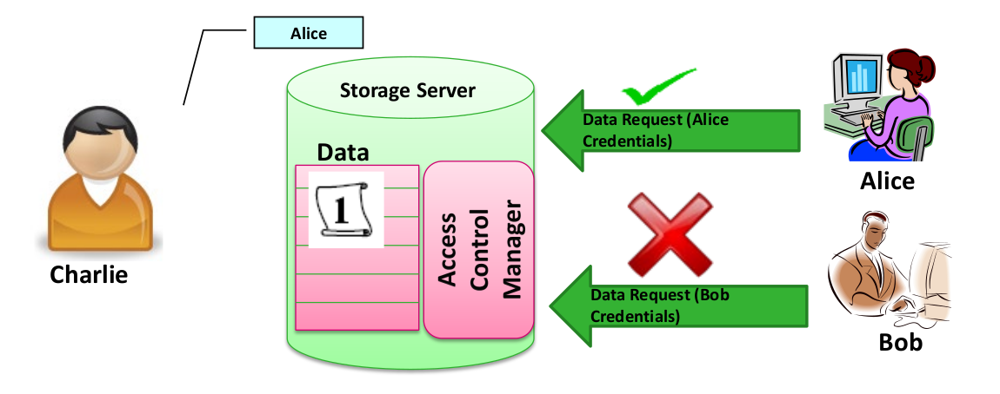

# Secure Data Management 2

## Functional Encryption

Functional encryption, rather than decryting immediately the message, allows to evaluate a function with a certain outcome: it might only say yes/no without revealing the decryption itself hence giving more flexibility in hiding information (a function is evaluated and only its results is revealed). 

Formally, a FE scheme for a functionality $F: K × X ⟶ \{0,1\}^*$ (where $K$ is the key space and $X$ is the plaintext space) enables to evaluate $F(k, x)$ given the encryption of $x$.

- $(msk,pk) \leftarrow Setup(1^{\lambda})$ master secret key and public key
- $sk_k \leftarrow KeyGen(msk,k)$ for $k ∈ K$

Standard PKE is a special case of FE: the function being evaluated is the identity function ($F (1, x) ≔ x$).

### Predicate Encryption

Rather than evaluate a function, the decryption depends on a predicate outcome: the evaluation of predicate will tell if the message has to be revealed. The message is typically a pair $(M × I)$ consisting of the actual payload and an index that must be given to the predicate: if the predicate is true, then we deliver the message, otherwise an error message is give without showing the decrypted message. 

The “Predicate” is defined as follows: $P: K × I ⟶ \{1,0\}$ where 

- $M$: payload message space
- $I$: index space; could be also a ciphertext attribute space (private or public)
- $K$: key space; could be also a key attribute space

The FE functionality $F$ is defined as
$$
F(k \in K, (ind,m) \in X) := 
\begin{cases}
      m & \text{if $P(k,ind) = 1$}\\
      $\bot$ & \text{if $P(k,ind) = 0$}
\end{cases}
$$
This scheme gives more flexibility since we have additional constraints to satisfy in order to carry out decryption. There are two example of *public indexes*:

- <u>Identity based encryption</u>: the predicate that needs the be evaluated is the identity proof (e.g. identity card)
- <u>Attribute based encryption</u>: a predicate is evaluated over certain attribute that the user must possess if he wants to decrypt a message (e.g. for medical records we must prove that we are doctors in order to access that information)

But we can also work with *private indexes*: the predicate is not visible, not publicly known giving even more protection means. Some examples are: 

- HVE: <u>Hidden Vector Encryption</u>
- IPPE: <u>Inner Product Predicate Encryption</u>

## Access Control: classical and advanced

AC in a classical sense is based on the idea that there is a central DB very well protected (hence data is in clear): if somebody want to access, there is a protocol at the entry point that grants access based on some attributes or identity (e.g. credentials). Today the situation is different because now data is distributed all over the places: that means that protecting only the entry point becomes useless.

The standard centralized model has two main vulnerabilities:

- *data is in clear*: we might bypass the AC manager and then directly access the data since there is no further protection;
- *we can bride the AC Manager* and have full access.

What can be done to address these two problems is to encrypt data: the decryption algorithm now does what the AC Manager was doing before. We must have an encryption scheme that handles credentials and evaluates them: this is what PE does.

### AUTHENTICATION

Authentication represents a well known problem. Its goal is the identification of people and/or devices (proving that they're really who they claim to be). Authentication can be achieved through 3 different approaches:

- What the entity **knows** (e.g. passwords, keys, ...)
- What the entity **has** (e.g. smartcards, tokens, SIM cards)
- What the entity **is** or **does** (e.g. biometrics)

These three approaches can be combined together becoming a multi-factor authentication process. One examples where such method is adopted is *online banking*: we use a PIN to log in and later authentication of a transaction is done by using an hardware token possessed by the entity.

Another way of doing authentication implies a challenge-response mechanism: two parties A and B know a (pre-shared) secret $K$ and they want to authenticate each other without submitting $K$. A sends some information to B, B generates a random number and sends it back to A. A encrypts the random number with the secret key $K$ and sends it back to B. If B proves that by encrypting the same random number with his version of $K$ he obtains the same results then A is really who it claims to be. 

This can often be done with PKE: in some sense, the message is signed and such a signature will be used to authenticate the entity.

However, this schema is not bulletproof. We have a lot of problems:

- Challenges should not be re-used! An attacker may record messages & replay them. Does not happen if space of challenges is large enough and challenges are randomly chosen!
- Ciphers must be robust against known-plaintext attacks
- Man-in-the-middle attacks? Replay attacks?

Dolev Yao elaborated an attacker model: if we want to do security proof, we must have a certain attacker model defined. The attacker in such a model is really powerful however he cannot break the crypto primitives. 

Needham is key exchange protocol resistant to the Dolev/Yao attacker model.

### CLASSIC ACCESS CONTROL

AC is a scheme that allows to have access to data based on certain rights the user has (access granted/denied). AC can achieve integrity and confidentiality of data and may be implemented on different levels, e.g.

- Database controls access to and updates of database tables
- Operating system controls access to files of database

A **subject** (e.g. a user, process) initiates access to an **object** (e.g. a file, resource, process) that needs to be protected. One entity can be both subject and object!

**Reference monitor** (= Access control manager) is the entity who grants access based on certain access policies hence it's important that its implementation is in a security environment (tamper-safe). It also provides a log of all unauthorized attempts.

**Security policies** define conditions under a subject may access an object hence they define relations between subjects and objects. Rights can be generic (such as read, write, access. ...) or more specific.

There can be two different model of AC:

- **Discretionary Access Control**: the owner is responsible for protection of data and rights are issued for individual objects (no system-wide policies). This is extremely labor intensive since for each object and subject their relationship must be explicitly defined. Almost all operating systems (e.g. UNIX, Windows) support DAC.
- **Mandatory Access Control**: rights are set system-wide by policies. User-issued rights are dominated (overwritten) by system-wide rights.

The most simple way of representing DAC is by using the Access Matrix: for each subject-object pair we defined the rights of the subject over the object. This solutions is very precise and fine grained. However, this option is not so good since it doesn't scale (it becomes huge with high numbers of involved entities).

An alternative is the adoption **Role Based AC** that does not talk about specific individuals but about their roles (e.g. teachers, students, admin personnel in schools). A subject can be in different roles at different points in time. *Sessions* are used to dynamically represent that roles may change overtime.

- User – Roles $sr : S → 2 ^R$
- Roles – Permissions $pr : R → 2 ^P$

We can also build hierarchies based on the roles (not really used, very popular with OOP). Definition of a partial order $≤$ on roles: if $R _j ≤ R _i $, then $R_ i$ has all rights of $R_ j$ and probably more. This means that rights are "inherited": a subject in a role has all rights of “lower” roles as well. Sometimes this gives rise to conflicts, as when inheriting rights from two different branches. 

- Static Exclusion ("separation of duty"): making sure that certain roles cannot be assigned to the same subject (conflict of interest). $SSD ⊆ R xR$ defines roles that are generally mutually exclusive. 
  $$
  ∀ R _i , R _j ∈ R, ∀ s ∈ S: (s ∈ Member (R _i ) ∧ s ∈ Member (R _j ))\\ ⇒ (R _i , R _j ) ∉ SSD
  $$
  where $Member(R _i ) = \{s ∈ S | R_ i ∈ sr(s)\}$

- Dynamic Exclusion: $DSD⊆ R xR$ defines roles that cannot be active at the same time.
  $$
  (s∈Member(R _i )∧s∈Member (R _j )∧\{R _i , R _j \} ⊆ Active(s)) \\⇒ (R _i , R _j )∉ DSD
  $$
  where $Active(s) = \{R _i ∈ R | (s, R _i ) ∈ session\}$

### ADVANCED ACCESS CONTROL

Advanced AC represents a way to deal with an "open environment": the encrypted data is on the server. The server is always in between A and B, it represents a mediator.

The access policies define who can access the data. In the example above, C defines the access policy (AP). For instance, A can read C’s data. The **Access Control Manager** enforces AP defined by C. The main drawback is that if the Access Control Manager is compromised, then this results in data compromise.

The main solution is to encrypt the data before sending to the Server. We make sure that A gets a decryption key and B doesn't. Everyone can get the encrypted data. Users, A and B, does not have to send their credentials in order to download the encrypted data. However, only A who has the decryption key can decrypt the data.

The main benefits deriving from the adoption of encryption are that there is no trusted third party mediating access to files or keys, hence there is no need for the Access Control Manager. Therefore, the compromise of the server doesn't compromise the data. Anyway, the server does not authenticate the user since everyone can download the data.

Encryption is then more secure, but there are several problems related to **Key Management** (i.e. how to distribute decryption keys to users to access the data). There are mainly two solutions (and drawbacks):
1. Encrypt each file with a different key: users should be online to get decryption keys since you don’t know the files you are going to create in the future.
2. Encrypt each file with the same key: fine gained access control not possible. If you allow one user to access one file, then the user can access all files.

The trick is to have an encryption scheme that allows to embed the AC policies in the encryption itself. This is when Attribute-based encryption becomes useful. 

Some examples of encryption techniques that will be used in this context are: *Ciphertext-Policy Attribute-Based Encryption (CP-ABE), Proxy Re-encryption (PRE) and Key-Policy Attribute-Based Encryption (KP-ABE)*. 

In all these techniques distributing decryption keys is offline (the first problem, highlighted before, is then solved) and they all support fine gained access policies (since decryption is based on predicates that the user owns).

##### CP-ABE

It is a type of PKE, hence distribution of keys is then much easier (since we can make them public). Messages are encrypted according to an AP over attributes (attributes are embedded hence we can control if decryption will be successful or not). The key that users get is based on the attributes they have. A user can decrypt the ciphertext if and only if the attributes associated with her secret key satisfy the access policy. In the end, it all depends on the set of attributes and the derived key.

A trusted authority (TA) has the secrets that are underlining the whole system (based on the attributes that are used in the total system, master keys, and keys used to build the users keys). The TA has the mean to validate the attributes a user claims. 

If we introduce new attributes to the system, we need to change all the keys while if we add an attribute to an individual then we only need to update its key: it's really important to design in the right way the attributes from the beginning. 

Anyone who wants to encrypt their message needs the $pk$ of the system. Everyone in the system can try to decrypt the message but only the ones with the right attributes will successfully carry out decryption.

Formal definition:

- $Setup -> (pk, mk)$: public key + master secret key by TA

- for every participant the TA generates a secret key based on their attributes
  
  - $Key Generation (ω, mk) → sk _ω$
  
  - $Encrypt (m, \tau, pk) \rightarrow c_{\tau}$: ciphertext depends on the AP
  - $Decrypt (c _τ , sk _ω ) → m$

Where:

- $ω$ – the set of attributes for a given user;
- $τ$ – the access policy;
- $m$ – message.

The expressiveness of the AP define the flexibility of the system's AC. AP must have some security requirements such as:

- **Collusion Resistance**: A has access, B not but we do not want that they are able to share their attributes and then be able to decrypt the message. It is not possible to combine attributes to decrypt messages: keys cannot be produced by combining two "subkeys";
- **Semantic Security**: for a computationally bounded adversary, it shouldn't be possible to derive any info on the plaintext with only the ciphertext and the corresponding public key. With computationally bounded we mean that no brute force attacks are possible.

#### Pairing Cryptography

In order to set up such an encryption scheme, PC is needed. PC uses a pairing between elements of two cyclic groups of order $p$ to a third group to construct cryptographic systems: $\hat{e}: G_0 \times G_0 \rightarrow G_1$. In CP-ABE what is needed are bilinear pairing: for all $u,v \in G_0$ and $a,b \in \Z_p^*$, we have $\hat{e}(u^a,v^b)=\hat{e}(u,v)^{ab}$ (exponentiation can be brought outside). Additionally, they need to have the property of *non-degeneration* (if we do the pairing of $g$, a generator for the system, with itself, the result differs from identity): $\hat e (g,g) \neq 1$. 

##### SETUP

The Trusted Authority generates a bilinear group $G_0$ of prime order $p$ with a generator $g$ and bilinear map $\hat e: G_0 \times G_0 \rightarrow G_1$ that works on the group. The TA then generates the collection of attributes used by the system, $\Omega = \{a_1,a_2,...,a_n\}$ for some integer $n$, and random elements $\alpha,t_1,...t_n \in \Z_p^*$. Let $y = \hat e (g,g)^\alpha$ and $T_j = g^{t_j} (1\leq j \leq n)$. The public key is $pk = (\hat e, g,y,T_j (1\leq j \leq n))$ and the master secret key is $mk = (\alpha, t_j(1\leq j \leq n))$.

##### KEY GENERATION

Suppose A has 3 attributes $\omega =(a_1,a_2,a_3)$: take random number $r \in \Z_p^*$, compute the exponentiation of this number wrt $\alpha$ and this is the $d_0 (= g^{\alpha-r})$. Then attributes are embedded and we build the $d$-expressions for these two terms ($d_1 = g^{rt_1^{-1}},...$). The secret key looks at all the attributes, $sk_\omega = (d_0, \forall a_j \in \omega: d_j)$. The randomness introduces by the initial random value protects against collusion attacks: the exponents will be always different thanks to the random number $r$. 

##### ENCRYPTION

The AP that needs to be satisfied is broken in shares which are represented by the number $S$. Random numbers are generated based on the shares that compose the overall tree: those play a role in the selection of the $S$.

Formally:

1. $s \in \Z_p^*, c_0 = g^s$
2. $c_1 = m\cdot y^s = m\cdot \hat e(g,g)^{\alpha s}$
3. $c_{j,i} = T_j^{s_i}$
4. $c_\tau = (\tau, c_0, c_1, \forall a_{j,i} \in \tau: c_{j,i})$

By splitting up the shares, we come up with the complete $s$ if all the components are there.

##### DECRYPTION

For the decryption we do complex computation:

- will result in the term $\hat e (g,g)^{rs}$;
- we use the bilinear mapping property: we can put exponentiation outside so that some terms cancel out in the nominator and denominator.

For better mathematical formulas refer to the slides.

##### REVOCATION

How can we revoke an attribute? We can get a new key, but the problem is that we might hide the old secret key and use it later (we cannot simply revoke the key and claim it back since we do not trust the user). This is the reason why a **Mediator** is introduced: half of the key is given to the user and half to the Mediator (who is under control of the system). Even if the user keeps the old half key, since the other half will be removed from the the mediator, the user won't be able to access the data with that attributes any more. This scheme is called **mCP-ABE (mediated CP-ABE)**: the key is broken in two pieces (two exponentiations are used) but the rest is the same as the previous scheme (only decryption is done in two steps). 