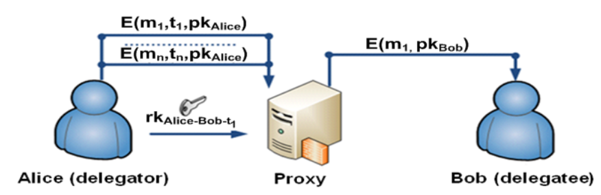
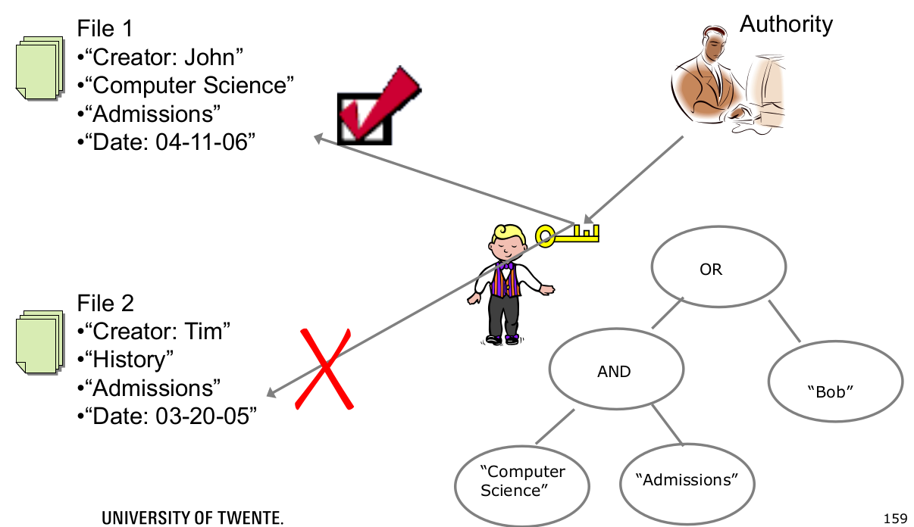
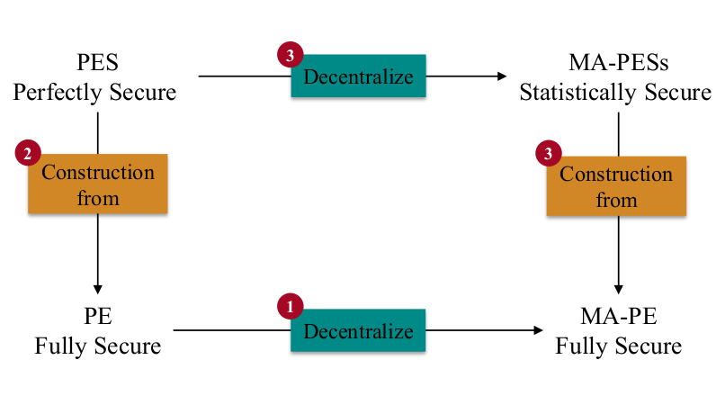

# SDM 3

## Proxy Re-Encryption

Typically a proxy represents a user when he cannot be active and present himself (e.g. proxy in a meeting), it's a sort of delegation.   

The general scheme for proxy re-encryption works as follows: the information is sent, then there is a re-encryption scheme and the message is given to the delegate. Of course, the delegate won't have total control on the message and he won't have the key (it must be kept secret).

The first example is based on RSA while the second is based on the El-Gamel approach (division by exponentiation working in a prime group).

In both approaches there are some security requirements that must be kept in mind. 

- Even if Proxy and B collude, it should not be possible to reveal A’s secret key. E.g. RSA proxy re-encryption is not collusion safe.
- It is preferable for B to use his secret key to decrypt the re-encrypted ciphertext, instead of using A’s part of the secret key.
- Proxy should not have access on the plain data (he must only forward the re-encrypted ciphertext). The proxy is honest-but-curious in the sense that has to follow the protocol (re-encrypt the ciphertext) but also may try to learn some information about plain data.

The two main types of such schemes are:

- **Uni-directional scheme**: the re-encryption key can be used to re-encrypt messages from A to B, but not the reverse. Only downwards delegation is possible.
- **Bi-directional scheme**: the re-encryption key can be used to re-encrypt messages from A to B, as well as from B to A.

In the formal definition of the protocol we have the following steps (very similar to the one discussed in the previous lecture):

- $Setup →(pk, mk)$ by TA: in the setup phase there is a cyclic group $G$ 
- $KeyGen (I, mk) →sk _I$ by TA: during this phase we should try to avoid collusion
- $Encrypt (m, t, pk _I ) → c _I$:. exponentiation
- $Re-KeyGen (I,I’,t,sk _I ) → rk _{I-I’}$ by Alice (delegator)
- $Re-Encrypt (c_ I , rk _{I-I’} ) → c _{I’}$ (different from revocation discussed before, where the key was split in two)
- $Decrypt (c _{I’} , sk _{I’} ) → m$ by Bob (delegatee): complex terms that are built from the encrypted terms and they divide one by the other. The bilinear mapping property is applied so that most of the terms can cancel out.

## Key-Policy Attribute Based Encryption

The encoding of the policy will be included in the key: is the key that must satisfy some attributes in order to be able to decrypt a message.

The ciphertext has now a set of attributes and the keys reflect a tree access structure: decrypt if and only if attributes from ciphertext satisfy key’s policy

The general idea is the same as the ABE scheme seen before, collisions are always an issue since by combining different files an attacker might be able to get the required properties needed to decrypt the files.  

As for the encryption, the scheme is very similar to the one presented in the last lecture: we have the groups and their bilinear mappings, the exponentiation, a set of attributes, then there are some public parameters and finally the generation of the ciphertext. The decryption works in the similar way: some terms can cancel out thanks to the bilinear property.

The security of such approach is based on the bilinear Decisional Diffie-Hellman (Given $g^ a ,g ^b ,g^ c$ distinguish $e(g,g) ^{abc} $ from random) and the collusion resistance (can’t combine private key components).

## General Predicates: Multi-Authority Predicate Encryption

Many applications require sharing of data however, once the data is shared there is no control over how it is being used so it could be used to infer more information than originally intended by the data sharer. Multi authority encryption systems try to provide more control over data usage. The main issue with this scheme is that, after distributing the encrypted data, the user is also in charge of regulating the accesses with more sophisticated schemes and special purpose keys.

In a single authority system, there is a collection of users and a cloud where encrypted data can be stored. The predicate returns either true or false based on the conditions being satisfied or not. 

The authority has the master secret and distributes the public key to the different users of the system which will use them to encrypt messages using policy encryption (different attributes). The encrypted messages are then stored in the public environment of the cloud. When a user wants to retrieve and decrypt a messages, its predicates are first evaluated against the ones of the message and if they satisfy the policy, then the plaintext is retrieved (the keys used for decryption are generated by the trusted authority according to the set of predicates of each individual).

The formal definition is the following: the predicate family $P = \{P_k\} _{k
∈\N^c }$ for some constant $c ∈ \N$ has the relations $P _k : X _k × Y_k → TRUE, FALSE$ where $X_ k$ is the ciphertext attribute space and $Y_k$ is the key attribute space. The $PE = (Setup, Encrypt, KeyGen, Decrypt)$ scheme defined for a predicate family $P$ comprehends the following steps: 

- $Setup (1 ^λ , k) → (msk, pk)$
- $Encrypt (pk, x, m) → ct _x$ ciphertext for ciphertext attribute $x$
- $KeyGen (pk, msk, y) → sk_ y$ secret key for key attribute $y$
- $Decrypt (pk, sk _y , ct_ x) → m$ iff $P_k (x, y) = TRUE$ otherwise $⊥$

The security requirements for such a scheme are the:

- **Correctness**: if the predicate is True, I want to be sure that the plaintext message retrieved is really the original message.  
- **Full-security**: we can build this up through a security game. This is basically the same approach adopted in SCC with the simulator, challenger and distinguisher approach. You have a challenger and an adversary: the probability to distinguish between the two answers you get back should be negligible. The adversary makes a lot of queries in the initial phase trying to understand the encryption mechanism behind. After this "warm-up", the adversary chooses a set of messages, sends to the challenger and gets back the encryption (but the adversary does not know which message was encrypted). (this can be done again with keys and getting back the just generated keys) If the adversary is able to correctly understand or not which message was encrypted previously (and we repeat this challenge multiple times), then we plug those results in the formula to calculate the probability which must be below a certain threshold $\epsilon$ otherwise the adversary managed to break the system. 

### Multi-Authority Predicate Encryption

PE uses a single authority that is responsible for creating the decryption keys for all users in the system. There are several consequences of relying on a single authority: 

- It may become a bottle neck thus impacting scalability
- It can decrypt all messages thus impacting privacy as well as security
- It is a single point of trust thus impacting confidence

Therefore multi-authority PE solutions have been developed to address the above consequences. They basically allow for multiple independent and more fine-grained assignment of authorizations to individuals (depending on which authority you refer to).

In the example presented above, we are in a medical setting linked to a university: there must be a distinction between two medical doctors in such a context, one focused only in treatments while the other is doing also medical research affiliated with a university. The info available for researchers is managed by the research institute that distributes decryption keys to researches, while more general information is handled by the authority of the hospital. This could be also done in a setting with a single authority, but in such a way we won't have resilience against failures and security of the information. With the two Authorities being distinct, the information is separated and the research institute won't be able to access data on medical treatment. 

Each different authority gives a different key to a user. The encryption scheme is reasoning over the different authorities predicates and keys.

The scheme is straightforward with the difference that the "multi-authority" is added in the construction of the set. A predicate $P_ k$ can be described by its family index $k$. $k(a)$ denotes the index $k$ that is specific to an authority $a$.

The global setup phase is the same but then an additional phase must be carried out for each authority. 

The Authority setup for an authority $a$ works as follows:

- Input: $pp$ and $par_a$ (some additional parameters)
- Output: 
  - $pk _a$: a public key
  - $ask _a $: an authority secret key for authority $a$
  - $k(a)= (N, par_a )$ predicate index

As for the encryption, key generation and decryption phase, the steps are the same but the fact that multiple authorities are present is taken into account.

The security requirements are the same as the ones previously mentioned:

- Correctness: this property must be true for each predicate of each authority where it operates on the right terms.
- Full-security: security game. The requirement is the same as the single authority scheme but the game is a bit more complex. Several encryptions from different authorities are used and select a set from these ones: send them together with two messages and then make other requests (with different messages). Then we need to guess of which message $c$ is the encryption of: this probability must be negligible. 

#### Construction of Fully Secure MA-PE for Any Predicate

It is done by using Pair Encoding which is the basis for probabilistic polynomial time algorithms. The formal steps defining such an algorithm are presented below ~~they will be asked but were not explained during the lecture~~:

For a $P_k : X_k × Y_k → \{TRUE, FALSE\}$ indexed by $k = (N, par)$

- $Param(par) \rightarrow n$ with $n ∈ \N$ the number of common variables $b ≔ (b_1 , ⋯ , b_n )$

- $EncCt(x,N) → (w_ 1 , w_ 2 , c(s, \hat s , b) )$ with: 

  - $x ∈ X _{(N , par)}$

  - $s = (s _0 , ⋯ , s_{w_ 1} ) \space \text{and} \space \hat s = (\hat s_ 1 , ⋯ , \hat s _{w_ 2} )$

  - $c = (c _1 , ⋯ , c_{w _3} )$ vector of polynomials in non-lone variables $s$ and lone variables $\hat s$
    $$
    c_l(s,\hat s,b) = \sum_{z \in [w_2]} \eta_{l,z}\hat s _z + \sum _{i\in [w_1]^+}\sum_{j\in [n]}\eta _{l,i,j}s_ib_j
    $$
    

- $EncKey(y,N) \rightarrow (m_1,m_2,k(\alpha, r, \hat r ,b))$ where:

  -  $y \in Y_{(N,par)}$

  - $r = (r_1,...,r_{m_1}), \hat r = (\hat r_1,..., \hat r_{m_2})$ and $α$

  - $k= (k _1 , ⋯ , k_{m_ 3} )$ vector of polynomials in non-lone variables $r$ and lone variables $\hat r$ and $α$
    $$
    k_t(\alpha,r,\hat r,b) = \phi_t\alpha + \sum_{z \in [m_2]} \phi_{t,z}\hat r _z + \sum _{i\in [m_1]^+}\sum_{j\in [n]}\phi _{t,i,j}r_ib_j
    $$

- $Pair(x,y,N) \rightarrow (E , \hat E)$ where:

  - $E$ matrix of size $(w_1+1) \times m_3$
  - $\hat E$ matrix of size $w_3 \times m_1$ 

~~the hat on letters means transposition of matrix~~

Again the same security requirements remain the same: correctness and perfect security. The correctness can be explained as follows: an initial value $s$ and the predicate is TRUE, then if the message is encrypted and the predicate evaluation is true, then there is assurance that the decrypted message is the same as the original one.

To prove perfect security becomes more complex: if the predicate evaluates to FALSE then it must be assured that the user has not access to the message. 

So far, we have studied the single authority scheme but now we are plugging the multi-authorities into the different formulas. We do so by adding a so called "lone variable" in the encryption.

However, in this scheme, we don't have perfect security, rather statistical security. The main differences between the multi-authority and simple variation can be summed up as follows:

- PES requires perfect security and hides the value $α$ in the adversary’s view
- MA-PES requires only statistical security and instead of hiding $α$ it hides only the value $ω$ in the adversary’s view. This allows to prove that an adversary cannot distinguish a correctly distributed challenge ciphertext from a challenge ciphertext taken from a more restricted distribution. This property should hold even if user secret keys are given, but only as long as the values $y$ associated to these keys do not let the predicate evaluate to TRUE.

Still, having a single authority, hence a single point of failure represents a bigger risk rather than having distributed authorities (even if the level of security requires is lower).

However, the name is misleading: Multi Authority admissible Pair Encoding (MA-PES) is defined for a single authority!

The basis on instantiating such a scheme for several authorities is that we switch from a regular bilinear map to a composite order bilinear map (needed to have the composition of the different authorities). 

To prove the security, we build a security game again: the challenger is asking for any kind of information, at a certain point he sends two distinct messages and if the system is weak then with a certain probability he is able to understand which message he got back encrypted. 

Complexity assumptions means that the community is convinced that solving the underlying (hard) problems have an exponential complexity. There is not always a proof and this is the reason why are called assumptions.

~~check all the formulas on the slides~~

What we want to prove is that this way of constructing the multi authority predicate encryption scheme from this specific encryption leads to a fully secure system. The proof takes the shape of rewriting he game into an expression that can finally be expressed into these assumptions.

#### Q&A:

- **Is collusion between different authorities prevented in MA-PE?** 

  To prevent collusion, it doesn't matter if you are in a setting with single or multi authority. What is typically done is adding the ID of the actor that can encrypt (or random values). An additional countermeasure is to embed the authority ID (or a random number) into the encrypted message so that an user cannot use additional information inferred from another authority to decrypt a message belonging to another one.