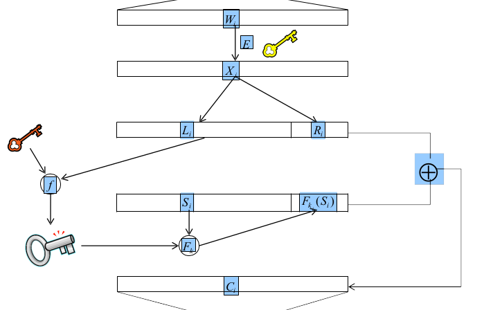

# SDM 4

## Provable Secure Searchable Encryption

> "Data is spread all over the place".

Due to the heavy use of cloud resources to store data, it is important to use encryption over the cloud. At the same time, people would like to be able to search over that data: search options improve a lot a database. This is being done by heavily relying on **trapdoors**.

The first, basic and "stupid" approach is downloading all the data every time and search for it. That solution does not really make sense. Another approach is using **Public Encryption with Keyword Search**. On a very high level, this solution uses searchable indexes to retrieve documents contained the queried keyword. Advantages are moving trust from the cloud provider to the index, however keywords are fixed and it is impossible to enlarge the keyword set. 

Formally, the general model for searchable encryption via with indexes is composed as follows.

- $I$: encrypted index.
- $K$: encryption key for the index.
- $DB$: database,
- $M_i$: message, which can be a record in a relational database, a file etc..
- $W$: Set of keywords $w_i$.
- $K'$: encryption key for database, often different than $K$.
- $T$: trapdoor function, enabling the server to search over $I$ using $f$,
- $f$: predicate used during search to match results (it can be very simple, checking if a keyword is present, more expressive depending on the scheme).

There are many different alternatives for Searchable Encryption Architectures, depending on who writes and who reads data. As soon as there are multiple readers, there is the need for a key distribution system. Other schemes instead can simply be built with symmetric or public encryption. The possible scenarios are 4:

- **S/S** (single writer, single reader);
- **M/S** (multiple writers, single reader);
- **S/M** (single writer, multiple readers);
- **M/M** (multiple writers, multiple readers).

Research is working with different goals: **improving efficiency**, reducing complexity of communication; **improving security**, relying on weaker assumptions and more solid security models; **improving expressiveness**, enabling more sophisticated queries. These three aspects are subject to a **trade-off** (e.g. more security could cause poorer performance).

Efficiency can be defined in terms of the complexity of a single query. It can be improved with pre-processing, i.e. building an index, but this is not always applicable. In general, we can list three approaches depending on the application ($n$ is the number documents, $w$ is the number of keywords):

- no index, search time is $O(nw)$;
- forward index (each document has an index indicating which keywords it contains), search time is $O(n)$;
- inverted index (each keyword has an index indicating which document contains it), sublinear search time, $O(log\ w)$ or $O(|D(w_i)|)$, where $D(w_i)$ is the set of documents containing keyword $w_i$.

Privacy instead can be lost by leaks, for example repeated queries or frequency of returned documents that can be used in correlation or become object of inference, to retrieve private information. Actually, the encryption of the documents themselves is usually not a concern at all. 

Security is defined in terms of different levels:

- IND1-CKA, indistinguishable against adaptive chosen keywords attacks (given two documents of the same size and an index, an attacker cannot claim which document is encoded in the index);
- IND2-CKA, same as above, but with documents of any size;
- IND-CKA and IND-CKA2, most used ones for non-adaptive and adaptive (resp.), claiming that nothing is leaked about the database except for search and access patterns;
- PK-CKA2, an attacker learns no information about a keyword unless the trapdoor for that word is available. No information is learned about the data (similar to the previous, but in public key settings were trapdoors are generated with public keys);
- SEL-CKA (Selectively Secure CKA): similar to PK-CKA2, but the attacker is more restricted as they have to choose the keywords before the first query phase;
- FS (fully secure): nothing leaks, except for the access pattern.

Query expressiveness can instead be understood as different types of searches: we can have SET (Single Equality Test), CKS (Conjunctive Keyword Search) and XQ (Extended queries, much more expressiveness, similarity/wildcard searches). You don't really see solutions supporting more complex expressions, like particular logical clauses. 

We will discuss some specific examples of searchable encryption, one per architecture with different expressiveness. In summary, almost all S/S schemes leak at least search and access pattern, so some work on privacy still needs to be done. In terms of efficiency instead, only a few of them have optimal search time, but leak search pattern (here we go back to the trade-off problem). *Willem expects us to understand only the schemes he is presenting during the lecture.* Various statistics from a survey are only informally introduced. Particular attention should be given to a problem with M/S schemes: due to the use of PKE the attacker can recover the predicate from a trapdoor, i.e., they can capture keywords. This can be prevented by protecting the trapdoors with PIR (Private Information Retrieval) techniques.

### Song-Wagner-Perrig Scheme

This is the first and simplest scheme: **S/S** with symmetric key, **SET**, **no index**, **linear** performance. Encryption of a document is done block-wise and each block ideally represents a word: each block is firstly encrypted (with $E$), then split in two parts; the left part ($L_i$) is fed together with another key to a function ($f$) that generates a third key ($k$), which is then used to encrypt a set of random bits ($S_i$). Finally, the ciphertext block ($C_i$) is created by xoring the encrypted block ($X_i$) and the block with the random bits followed by their encoding ($\langle S_i, F_k(S_i) \rangle$). The example is really informative and helps understanding this schema. Note that $F$ and $f$ are not really pseudo-random functions, but are just "made up". In the original paper these two functions should be secure PRF.

To search a keyword, the steps are the following: the keyword is encrypted using $E$ and then xored with every block of the ciphertext; then, if the keyword matches a given block, the result of $F_k(S_i)$, computed with the right segments of the block, will match with the right part of the block; otherwise, it will not. Again, refer to the example for a clarification.

Multi-party computation is the security scheme for secret sharing, in which multiple parties have a chunk of a secret that if combined results in the secret. This can be done, for example, with polynomials, as shown in the slides (remember Shamir Secret Sharing). MPC can also be used in secure client-server searching (in a Single Writer - Single Reader scheme).

First of all, keywords are mapped to an identifier (e.g. "name" is $1$). This is a crucial step, as it provides the encoding, otherwise data would be plain. Then, data is represented with a tree, where nodes stand for keywords: each leaf is a polynomial whose root is the keyword (e.g. for "name", $x-1$) and each node gets the product of its children multiplied by its polynomial. The way search is performed in this representation is guided by the values generated by these polynomials. Starting from the root of the tree, substitute to $x$ the searched keyword: only when $x$ is a root of the polynomial the result is the zero, thus only proceed visiting the subtree rooted in the node with result zero. Thinking about the way these polynomials are built, this results in a path from the root of the tree to a matching node, with complexity $O(w)$. **WOW**.

The trick is now to split this between client and server. Before doing that, we put everything in a finite field to reduce the complexity of polynomials, with the prime bigger than the largest keyword encoding. If you store the complete polynomial in the same place, everything is plain, while if you split it up only who has both of them is able to reconstruct information.

These two trees are indeed constructed in such a way that for each node, the sum of the polynomials of the two trees result in the polynomial of the original tree. To search, the client asks the server the result of substituting the encoded keyword in one node (starting from the root); then, they sum this result to their one and if it equals zero, they proceed with that subtree in the same way; otherwise, that branch can be ignored. In other words, intermediate results are sent between server and client for each every node to implicitly traverse the initial "master" tree. 

