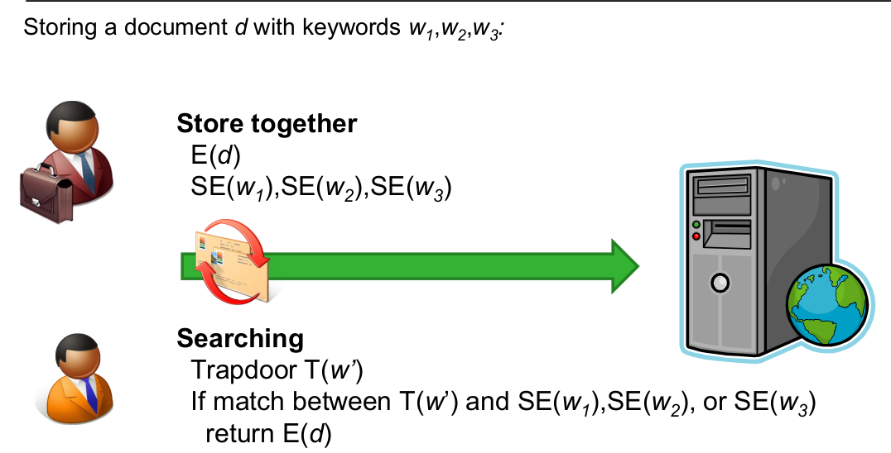
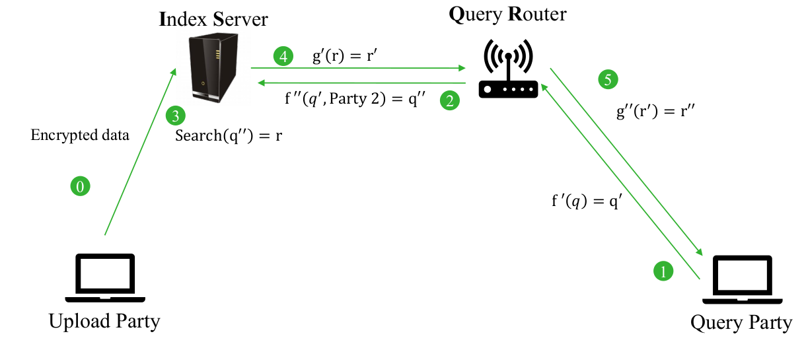

# SDM 5

## Multiple Write - Single Reader 

### Searching keywords with wildcards on encrypted data

A distributed system with public encryption allows to have complex environments where a lot of parties interact with a single server. In the scenario we are analyzing, we assume to have several parties writing to a remote server but only one user can read the data. How can we store information and search for it in such a context?

The encrypted document itself is stored in the server and the encrypted trapdoor gives the searchable word to look for in that document. It is encrypted in such a way that it can be used to match the words in the encrypted document (granularity is at document level). If the searchable word is matched into the document then the encrypted document as a whole is returned.

The setup steps of the algorithm are the same for each approach we have seen so far. Since all the approaches we will tackle during this lecture involve that either the readers or the writers are multiple (or even both), there is the challenge of distributing the keys since we have different parties interacting with the data.

#### Wildcard searches

Through this technique, expressiveness is enhanced. It is an extension of exact keyword searches (i.e. where $w=w’$) and is really handy for several applications since it provides additional flexibility in queries without having to repeat different similar queries. We like more flexibility, e.g. if we look for $ba*$ we want to find documents with keyword $bad$, $bag$ or $bat$ (that share the same leading chars). Thus, the support for a wildcard character (\*) in the search-queries is enabled (note: the $*$ means a single character).

How does it work? We use an anonymous IBE (Identity-based Encryption)-like scheme where the encryption keyword is represented as a tuple of symbols $w_1,...,w_n$ (e.g. unique chars). The trapdoor is derived by putting a wildcard $*$ at certain positions in that tuple, $w_1',...,w_n'$. The test is made for each individual position and returns true if and only if for all $i$ either $w_i′ = w_i$ or $w_i′ =*$.

The way it works is comparable with what seen before: in the encryption phase, we have at least one group element for each symbol (e.g. character) and then for the trapdoor we create the different elements corresponding to the different individual symbols. No terms is created if the corresponding symbol is a wildcard. 

The number of terms and number of encryption elements can be optimized to a certain extent: some elements of the encryption and some of the trapdoors are grouped together (into group elements) to do less comparisons. There won't be anymore a 1-1 correspondence between elements. To solve this new challenge of finding matches in combinations of terms, a sort of hashing functions are introduced. 

ATTENTION: trapdoors for wildcards have no elements!! The slides are wrong!

Let's go more into details:

- encryption keyword: $w_ 1 , ... , w_n ∈ Σ ^n$
- trapdoor keyword: $w_ 1′ , ... , w_n′ ∈ Σ _∗^n$

Let $J ⊂ {1, ... , n}$ denote all the positions that contain a $*$. Now, a polynomial with all the elements in $J$ is built, $\prod_{j\in J} (i-j)$ (all the element in $J$ are roots of this polynomial). This can be rewritten in terms of coefficients and exponentiation as $∑ ^d _{k=1} a_k i^k$ for certain $a_k$ where $d = |J|$. The roots of these two different representations stay the same (at the wildcards positions).

Now, if $w_i′ = w_i$ for $i ∈ J$ then for all $i$ it holds that:
$$
w_i'\prod_{j\in J}(i-j)=w_i\sum_{k=0}^da_ki^k
$$

If we compare a wildcard position, the term on the left will degenerate to 0 (since it's a root), the terms on the right will be 0 but if we do an exponentiation to 0 we get a 1 and we can remove that term in the comparison (is the identity element in multiplication). We don't care if it resembles the same char in the ciphertext or not since it's a wildcard. 

We compute the left and right terms, if the remaining multiplications (the multiplications for the wildcards will be evaluated to 1 hence the identity element for multiplication) are equal at both sides then we have a match.

A random variable $r$ put against collisions. During the trapdoor generation we exclude the elements in $J$ since as previously said, for wildcards we do not generate searchable elements.

Security wise there is some additional overhead. Security is based on Decision Linear Assumptions:
$$
\text{Given} \space g^a,g^b,g^{ac}, g^d \space \text{cannot distinguish} \space \begin{cases}
    Z=g^{b(c+d)}\\
    Z \space \text{random in } G
  \end{cases}
$$
The inverse of the exponentiation is not feasible. The method hides the encrypted keywords until the search takes place. The security in this case is in the *selective* model.

Performance-wise is important the number of pairing that needs to be done but the nice thing about this approach is that the number is fixed. 

Hidden Vector Encryption can be used in selective models. 

For comparison with other existing scheme please refer to the tables in the slides: additionally, note that the dimension of the public key (i.e. $n+N+2$) is less than $2n + 2$ given that $N\leq n$. We can limit the size of ciphertext by limiting the amount of allowed wildcards at setup/encryption time.

Additional comparisons for the number of groups (pairings) can be found in the material too. Prime order is always preferred to composite order. Note that the Test-algorithm needs a constant number of pairings, which makes the searching process fast(er).

The proof of security is in the so-called ‘selective’ model but Waters’ Dual System Encryption seems to fit well. Trapdoors reveal the location of wildcards: leaked through the set $J$. If we want to hide that, then additional mechanisms should be adopted. 

## Single Writer - Multiple Reader 

### Secure Anonymous Database Search (SADS): Single Equality Test

The data of one user is stored encrypted on a minimally trusted server while many users can make queries for single equality tests, e.g. ‘Which documents contain keyword $w$?’. A possible example of such a context is the one of SADS (Secure Anonymous Database Search) schemes.

Main features of this approach are the following:

- **Different granularities** of search capability for different users: for example some users can search the whole database vs. others only a few documents or search for any keywords vs. no search for some specific keywords. We can "play" with access rights that are given through allowed searches.
- **Authorization and search is separated**, thus more privacy is guaranteed to users.

The scheme is set up with 2 Honest-but-Curious servers intermediaries:

- **Index Server (IS)**: stores encrypted index produced by the data owner, and executes submitted queries. Does not learn the identity of the querying party, the query content or anything about the underlying database.
- **Query Router (QR)**: connects querying users to the IS without revealing identities of either participant to any other entities, and translates encrypted queries such that the IS can provide encrypted and untraceable results without learning the query content or the result. The QR issues trapdoors to the IS.

The Upload Party (single writer) uploads its encrypted data and provides IS with the search structures. The Query Party (multiple reader) submits encrypted keyword queries anonymously to IS via QR. IS sends back the encrypted search result through QR.

The main issues are correctness (correctness of the returned answer, toleration of false positives or negatives), client security (the data owner, i.e. the uploader,  does not learn anything about keywords or the querier itself, queries must be anonymous), server security (the querier learns nothing about the data except for the specified output for his query), server access control (only authorized readers can submit queries and receive output for this data) and client anonymity (reason why intermediate servers are introduced, the writer does not learn anything about the readers and there is no linkage between two queries coming from the same client).

Additional security requirements are the following:

- Data Security Against IS and QR: both IS and QR learn no information about the data stored in the server.
- Client Anonymity Against IS: IS learns no information about the identity of the querier (including unlinkability).
- Client Query-Security-up-to-Equality Against QR: given a sequence of queries from a given client, QR may learn nothing beyond which of the encrypted queries are the same.
- Clients Result-Security-up-to-Equality Against IS: given a sequence of queries (forwarded to IS by QR, possibly originating from different clients), IS may learn which of the encrypted queries are answered with the same set of matching documents. No other information about the queries (or the client(s) who generated them) may be learned by IS.

The ability to learn these equalities comes from the deterministic encryption used in the scheme.

The two main building blocks of SADS are:

- **Re-routable encryption**: given the two servers, we use the QR to transform one ciphertext to another by encrypting the former with a different key. This is used to protect identities since the transformation key is only known to the intermediary party (the QR in our case).

  We have a sort of translation and an additional encryption step to change the ciphertext so that the end receiver has no information on the sender.

  For formulas refer to the slides.

- **Bloom filter**: adds efficiency in the system; they represent a sort of index structure on data that makes possible to have very fast searches. No false negatives, some false positives.

  A BF is a probabilistic data structure to test membership of an element in a set (with no false negatives). It uses $h$ different hash functions to test the membership of an element in the form $H:\{0,1\}^* \rightarrow \{0,...2^m-1\}$ and one bit vector (initialized to 0) of length $2^m$. Basically when a new element is to be added, the $h$ different hash functions are computed returning $h$ different positions for the element: all the bits in these positions in the bit vector are changed to 1 (either they were 0 or already 1). When testing membership, the $h$ positions are computed again and:

  - If in each of them the bit in the vector is 1, there it may be an element;
  - If there is at least one index where it is 0, then it is definitely not element.

  It can return false positives but then the exceptions are checked.

Deterministic private key encryption provides a fast search while maintaining an acceptable security level for SADS’s setting (security-up-to-equality, not safe against equality check). To bring some randomness they used hash functions. The ‘randomness’ is the hash of the private key $s$ and the message $x$, so encryption of the same message under the same key is always the same!

Slide 14 shows an example of how this approach can be applied, low level, to bit factor words. In some cases padding might be needed when words have different lengths. In the case of SAEP padding, an identity padding is used while in SAEP+ a function depending on the message itself is used so to have more "randomness".

The steps to setup this scheme were not explained during the lecture hence details can be found in the slides and papers.

SADS scheme satisfies the security requirements of both a general secure anonymous keyword search scheme and SADS requirements for honest-but-curious Index Server and Query Router, under the discrete log hardness assumption and in the random oracle model.

Few remarks on efficiency: the trapdoor generation requires 1 encryption (client) + 1 transformation (router) for each query. The search requires only 1 BF lookup. The communication between client and IS sends 1-1 message while the QR sends 2 messages. The Pre-processing requires index generation hence the definition of one BF per doc (linear in the number of keywords in the doc). If a change is made in the document the BF needs to be rebuilt for that document.

## Multiple Writer – Multiple Reader

### Public Key Encryption with Conjunctive Keyword Search and Its Extension to a Multi-user System

The expressiveness in this context will be more complex: conjunctive keyword search meaning that in one query we address multiple keywords.

mPECK: multi-user Public-Key Encryption Conjunctive Keyword Search

Data of multiple users is stored encrypted on a minimally trusted server and multiple users can make queries for conjunctive keyword searches, e.g. ‘documents containing keyword1 AND keyword2 AND keyword3’. We have a document-level granularity.

We assume some simplifications such as:

- Same keyword never appears in two different keyword fields
- Every keyword field is defined for every document
- ‘to.Null’ for a field that doesn’t have a valid keyword
- Don’t mark field names in keywords!

The underlying security model is the Decision Linear Diffie Hellman assumption. We have groups and exponentiation, we multiply them and try to decide which $x$ and $y$ are summed to give $z$ as result. The assumption is that in probabilistic polynomial time this is not possible. We will find this again when constructing the security game model.

Multiple parties can upload: each party owns two keys, a public one $pk$ and a secret one $sk$. They upload $pk$ but keep $sk$ hidden. A client sends a trapdoors queries and wants to find the keywords matching the trapdoor (using $pk$). In the query $Q$ there can be a list of keywords, $ \{I_1,..,I_N,w_{I_1},...,w_{I_N}\}$ (conjunctive keyword keyword) where $\{w_{I_1},...,w_{I_N}\} \sube W$. 

The scheme itself has the same setup steps. 

Semantic security against two variants of chosen keyword attacks: 

- IND-CC-CKA (indistinguishability of **ciphertext** from **ciphertext**)
- IND-CR-CKA (indistinguishability of **ciphertext** from **random**)

#### Ciphertext-Ciphertext

Usual way of working: first phase of probing, then we get the actual query. Two words sent and we get only one encrypted back. Can I find which one was encrypted? Additional probing and then we have to make a guess on the keyword we got back. If the choice was right then we won (should have the same probability of tossing a coin, so 0.5).

#### Ciphertext-Random

In this case we get the adversary to choose only one keyword, the challenger chooses the other one randomly and sends back the encoding plus the random word chosen. The adversary has to state whether the encrypted world he got back was actually the one he sent or a random one.

A limitation for PECK is that for each user a different encryption must be uploaded in the server and then the different keys are given to the different users. **mPECK** solves this limitation.

Multiple actors can upload data and multiple actors can ask queries. The upload is sent to the server. Key generation is slightly different in this scenario (there is a set of $pk$ not only one). Given that these keys are generated from the same underlying secret, they are linked to each other and the system can work.

The two security games are very similar with the exception of multiple keys being used.

