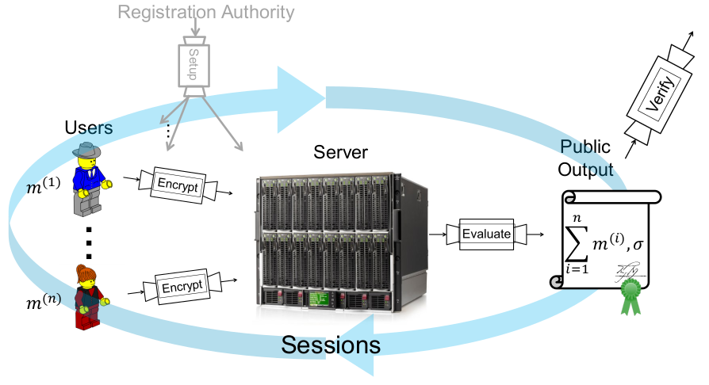

# SDM 6

## Secure Distributed Data Protection

#### Private Data Aggregation (PDA)

A huge quantity of data is being managed online and leaks/breaches are growing exponentially. The problem is that data is very often not encrypted. encrypted with the same key or decryption keys are easy to find together with encrypted data. The setting from which we want reason is the one of a data aggregation, represented by a server. Many users send data to this server, that makes some computations and publishes some statistics about it (e.g. sum or averages). With Time Series Data we refer to data collected and assembled during the same session. The goal is publishing only statistics while keeping our personal data protected: this is what PDA is about. Think about the case of participatory sensing: several people send their answers (i.e. sensitive data) to an untrusted server and then statistics are shown to the public. The goal of this section is building a Privacy-Preserving Data Aggregation service.

Of course, if all data is being sent encrypted, the server needs a way to still elaborate its output (which needs to be only aggregated data). One first approach in 2010 makes use of registration authorities and threshold homomorphic encryption: participants register to the server, send their answers in encrypted form (after being queried by the server) and the server computes its statistics (using the properties of homomorphic encryption). Although correct, this schema requires a lot of interaction.

The second schema works without homomorphic encryption (first PDA scheme). The key is distributed among all the participants together with the server (it owns the last chunk so it will be able to decrypt only the sum and not the plain data). But there is still a problem: what if the untrusted server publishes a biased result, perhaps considering only a subset of the data it has received? And here comes an additional improvement, constituted by a certification to publicly verify that the server has used all the required data in a specific session.

To formalize the scenario and its security requirements, we have a set of messages that cannot be discovered by anyone (and the ciphertexts should be indistinguishable). The server can only decrypt the sum, and this should be possible only if all user contributed and only for the current session. Finally, the server should also be able to compute a signature of this sum. In other words, messages are not known by anyone, but still we can verify that they have been used to compute the sum. 

The proposed solution combines two techniques to achieve the result: 

- **special threshold encryption**, so that the server can decrypt the sum of all the messages (if all users sent them all);
- **homomorphic signature**, allowing the server to compute the signature of the sum from the product of the signatures of the addends ($\sigma(m) \cdot \sigma(m') = \sigma(m+m')$).

From the encrypted signatures, the server can compute the sum and a signature on it.

The implementation makes use of four algorithms, refer to slides for the full formulas.

- `Setup`: takes the security parameters and the number of users; distributes secret keys to every user ($K_i$), an evaluation key to the server ($EK = -K = -(K_1+...+K_n)$) and some public parameters ($PP$).
- `Encrypt`: takes a session identifier ($id$), $PP, K_i$ and the message; calculates the ciphertext ($c^{(i)}$). This encryption is a point on an elliptic curve with pairing (we apply two different hash functions to derive the resulting point). Both $K_i$ and $\alpha$ represent secrets of a user $i$.
- `Evaluate`: takes $PP, EK, id, c^{(1)}, \dots, c^{(n)}$; calculates the sum of users' messages and outputs also its signature.
- `Verify`: takes the sum of all messages; tries to verify the signature with all the possible generated sums of the message space. This is polynomial in the size of the message space. 

There are some details on the formulas and the implications of homomorphic encryption etc. on the slides.

In conclusion, we end with a private (i.e. messages are encrypted), non-interactive, proven secure, publicly verifiable and computationally-inexpensive data aggregation scheme. Despite these positives, no statistics more complex than summation/average can be computed, the message space is restricted, dynamic settings cause inefficiencies and a user-server collusion can falsify the output (i.e. here we are only trying to preserve privacy). 

#### DECANTeR

This is an application of traffic monitoring on outbound traffic in order to detect anomalies. There is a lot of attention on inbound traffic (e.g. filters that look for malign patterns, firewalls etc.), but very often people seem to forget about data being sent from the data center that was not supposed to be sent. For example, attackers may succeed to bypass controls like firewall and anti-virus, install software on target machine and that software could start sending data from that machine. DECANTeR is an approach to try to detect these attacks, saying something like "hey, I see strange traffic, is that okay?".

There are solutions on the market based on white/black lists, containing hosts that you know what kind of data will be sent to. This way, the server can decide what data should be sent to who, controlling the sanity of these operations. However, this is a bit limiting because you need to know in advance where your data is going. Additionally, this does not prevent MITM attacks: what if a trusted receiver has been taken over by an attacker? Also, there are solutions based on content analysis, to see when and what kind of data is being sent out and to whom. Detection is always "suspicious", it does not guarantee that hacks are real. They should only be investigated and not go unnoticed. While being effective against accidental leakage, both these approaches fail with more complex malware, exfiltrating data with encoding, encryption or compression.

DECANTeR focuses on context with a content-based approach. Hosts normally have a fixed and specific communication pattern. This pattern can be profiled and modeled so that anomalous behaviors from applications can be detected, as they do not respect the normal pattern. We have a set of different applications running on a machine, based on the settings of these apps we have a profile of communication of data leaving the machine and we want to be able to detect unexpected behaviors and which application is responsible for that.

We only focus on HTTP. Why? Because it produces high throughput, a lot of browser traffic, cannot be blocked with firewalls (so potential leaks), more interesting from how data can be exfiltrated and how attackers can steal it. HTTPS traffic can also be analyzed, with a TLS proxy (and certificate pinning, basically acting as a MITM), but we focus on HTTP by now. 

The way this solution works is by an initial learning (training) phase, in which it learns a fingerprint for each host through HTTP traffic, then a monitoring (testing) phase at fixed intervals, to check if live traffic matches the fingerprint. More in detail, data is collected by a form of clustering, based on User-Agent values during an aggregation time $t$ (application-level granularity). These clusters can be labeled as Background or Browser applications, through a structure called Referrer Graph (trying to abstract the dynamic behavior of browser traffic). Finally, an exfiltration filter inspects the single nodes of this structure, isolating requests that may belong to exfiltration attempts.

The fingerprint is generated with different data, depending on the type of cluster. For background activity, we use host, constant header fields, average size of messages, user-agent and outgoing information, while for browser activity we use only language, user-agent and outgoing information. Matches with fingerprints are done using a similarity function, assigning a score to each field in case it corresponds or not. Then there is a threshold: if this threshold is crossed, we have a match (so data is "normal").

When to trigger an alert? It is important to stress that we want to minimize the number of false positives, otherwise the system can be overwhelmed in just trying to handle alters. In case an unknown application is found, an alert is triggered if the outgoing information exceeds a certain limit, or if it has a known browser user-agent: in fact, benign applications never try to simulate browsers, while malware do, in an attempt to act without being noticed. 

Just like every other machine learning approach, DECANTeR has passed an evaluation. The dataset have been built logging network traffic at the UT and results are good, but nothing is extremely interesting, refer to the slides for the full picture.

To fool this solution, a malware could:

- exploit the parameters of the monitor, e.g. elaborate a crafted functioning to respect the threshold and the aggregation time;
- mimic dynamic behavior of a browser, copying exactly the same parameters;
- mimic an installed application running in background;
- sniff live network and spoof a request.

Limitations are given by the referrer graph, which is practically a single point of failure, and fingerprinting techniques that could be improved.