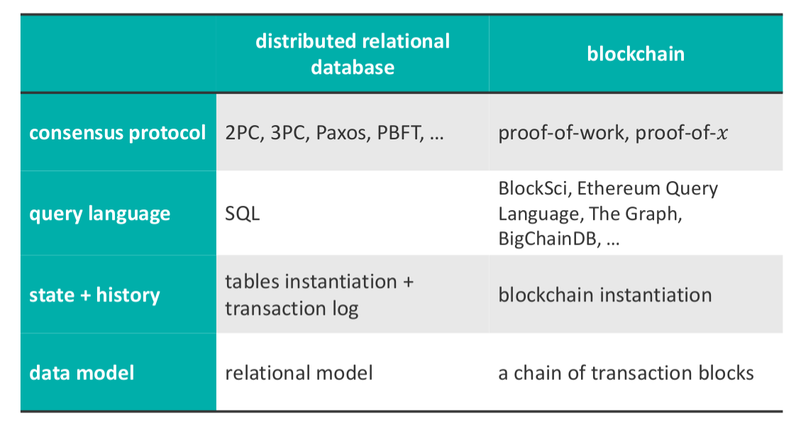

# SDM_7

In the lecture we'll have a look at DataBase principles. Blockchain will be compared to a Distributed DB  on 4 different levels: data model, state + history, query language and consensus protocol. 

When do we need a BC? Right now, BC are extremely hyped (can be found everywhere). BC can be seen as Distributed Data Management Systems and thanks to that, the best application domain can be derived. 

## Data Model

### DataBase Primer

In a Relational DB, Data is organized in tables where rows are also termed “records” or “tuples” and columns are also termed “fields” or “attributes”. 

DB can be defined, created, maintained, and their access controlled though the **Database Management System** (DBMS). The DBMS uses a database engine (or storage engine) to manipulate (create, read, update, and delete [CRUD] ) the data in the DB. The data in a database is manipulated through **transactions** sent to the DBMS: one transaction can contain several CRUD operations. 

The query language is the language used to interact with the DBMS, in relational databases this is often SQL (Structured Query Language).

The **state** of a database refers to the data it stores at a specific point in time. A transaction changes the state (or keeps it the same in case of only read operations). Finally, the data model describes how the data is stored in the DB.

A transaction is a unit of work that operates on one or more databases and that may consist of one or more “steps”. A transaction is *committed* if all step complete successfully and the result is stored permanently. It is *aborted* if one or more steps failed to complete successfully; the system is reverted to the state it was before the transaction took place (the part of transaction that was done needs to be reverted). 

A very simple example of application is the one of money transfer: it needs to be one action since we want data to leave the bank account of the sender and reach the receiver's one.

Transaction must have the **ACID** properties:

- **Atomicity**: either a transaction is completely executed or not at all;
- **Consistency**: a transaction does not violate any invariant, e.g., validation rules (e.g. age < 100);
- **Isolation** (= Serializable): multiple transactions may be executed in parallel, but have to look as if they were sequentially executed. This imposes an order to follow in order to preserve consistency;
- **Durability**: a committed transaction is persistent (it guarantees the state), e.g., does not get lost in a power failure.

The Atomicity and Durability transaction properties can be satisfied using:

- **shadow paging**: updates are **not** in-place, but are written to a new page; to complete the transaction, the database updates the references to point to the new page
- **write-ahead logging** (WAL): updates are written to a log (not part of a DB itself) before the updates are written to the database; the log makes rollbacks to a consistent state possible if something went wrong

The Consistency and Isolation transaction properties can be satisfied using: 

- **locking**: allow multiple readers to access or one writer to update the data; e.g., two-phase locking (2PL). It avoids the fact that two different transactions affect the same data and reach an undefined state;
- **multiversion concurrency control** ( MVCC ): updates create a new version of the database, allowing reads and writes to take place at the same time

MVCC is most often used by modern databases since its faster than locking and does not provide serializability, but a slightly weaker form of isolation termed snapshot isolation.

Data can be stored also in other formats a part of Relational DB, e.g. Hierarchical Database, Key-value Store or Document Store. Data models are orthogonal to the operations mentioned before. The most visible difference between all these DBs is how data is stored and queried. 

### Distributed DB

When we talk about ledgers and BC we talk about distributed environments. Distributed DB can be implemented in several ways: 

- Parallel DB: things are running in parallel;
- Decentralized DB: more links between the different settings;
- Distributed DB (P2P): there is replication of storage, it is completely symmetric independently of the starting 'node'. This is the model that will be later used in comparison with the BC.

###  Blockchain

Distributed DB have been around for a very long time. From a high level overview, the Blockchain is a distributed data structure (can be seen as a P2P DB) where we have a ledger where we record the committed transactions. Anybody can make changes but only valid ones are accepted and propagated through the network. These are agreed through a consensus protocol with the other peers (e.g. the majority of them agree).  

What is really a BC? Fun fact: there is not a single definition. Blockchain can be considered just the data model (a chain of transactions grouped into blocks) or a technology (it has become a synonym for distributed databases). While technically less correct, the term “blockchain” (certainly “permissioned blockchain”) is increasingly used as a description of a new distributed database.

Similar to non-distributed databases, distributed databases can structure their data storage in different ways. They can be relational or blockchain DBs (e.g. Bitcoin). 

A block is a container for multiple transactions. Blocks are linked and this link is hard to change (made using hash functions). The order of the BC cannot be changed, it is a true representation of the reached consensus.  

On one hand we have the chain itself which is linked in a solid way through hashing. Fraud is not possible in such a scenario (distributed guarantee). This is considered as one of the main advantages of Blockchain: there is no single authority saying what is right and what is wrong. This is a very democratic property as opposed to centralized systems (Bitcoins are considered democratic currencies while the standard one are controlled by central banks, but is this true?).

In the blocks we have the header and the container with the individual transactions. To make sure that also the content cannot be changed, another hash tree is built to protect the individual content (**Merkle tree**). Bottom nodes are the values that are to be stored in the container of the block, and we repeatedly apply hash function: it becomes very difficult to change a value, it's not easy to reconstruct the intermediate tree structure. It is important that the adopted hash function are non-revertible and collision-resistant. 

This concludes the comparison on data model level. The data model is in the relation model for the distributed DB while in the BC we have a chain whose correctness is guaranteed and provisions to prevent fraud on the stored values.

## State + History

A distributed transaction updates data on two or more systems. The main challenge in a distributed environment is to handle hardware failures, software failures, and network failures, while preserving the ACID properties of a transaction.

The state of a distributed relational database is its data stored in tables. To satisfy the ACID properties, also in distributed databases, a **transaction log** is kept to keep track of the history. If something goes wrong during a transaction, already made changes can be reverted using this transaction log.

In a Blockchain the transaction *are* the state: the data itself is not stored, but the transactions to the database are. To get the up-to-date state, all transactions need to be executed. The transaction log is central and everything is built up around that, while in distributed DB everything is built up around the state. Viewed as a relational database, Blockchain only keeps the transaction logs, not any additional state.

## Query language

In relational databases the typical query language to use is SQL (Structured Query Language). SQL queries allow for manipulation of the database in several ways [CRUD operations].

The blockchain data model is append only, it only allows for appending new blocks: blocks cannot be updated or removed, as this breaks the validity of later blocks in the chain.

As already discussed the blockchain only has an implicit state: getting the current state of the database (e.g., the current balance of all Bitcoin users) can only be obtained by replying all transactions and keeping track on how they affect the state. In Bitcoin, wallets are used to have an explicit state.

Blockchain does not have a single “standardized” query language. To allow for analysis of the blockchain, a vast amount of tools have been developed for this purpose: BlockSci, Ethereum Query Language, and TheGraph.com (using GraphQL) are several examples.

Often, Blockchain transactions are put in a local (relational) database for more efficient querying, e.g., using SQL.

## Consensus Protocol

The main difference between Distributed Relational DBs and Blockchain is at the consensus level. 

In a Distributed Relational environment, each site is managed by it own independent DBMS with a transaction manager which is responsible for subtransactions on that site and performs prepare, commit, and abort calls for subtransactions. Each site must agree to commit their subtransaction before the overall transaction can complete: **consensus** is needed.

In order to reach this consensus there are some transaction protocols to follow. One of them is the **Two Phase Commit (2PC)** protocol and it allows multiple parties to agree on either committing or aborting a collection of subtransactions. Unanimous agreement is needed. If a system fails, it will recover (“fail-recover model”) by looking at the log and restoring the last consistent state. Each system keeps their own write-ahead log for recovery. 

One transaction manager is elected as coordinator while the other ones are termed participants. The second phase represents voting: the coordinator asks the participants whether they agree or not on committing a certain transaction. If everyone voted to commit, then the coordinator broadcasts the commitment of the transaction and waits for an ACK from all the participants. If one of the participant voted to abort, then the coordinator broadcasts the abort: the participants roll back to the previous state (or not execute the transaction) and send an ACK. 

Assumption: nodes are honest.

An important feature (drawback) is that the protocol is **blocking**: no progress is made if one of the nodes fails, a single node can delay the entire protocol (the coordinator needs to receive all the ACKs), node recovery is essential to progress in the protocol.

To solve this blocking issue, we can introduce an additional phase to the protocol (**3PC**). It adds a prepare to commit (**precommit**) phase before the commit phase so that the participants have time to prepare and a timeout to every phase. 

The main drawback is the one of network partition: if the network is "split in two", then we might have inconsistencies between the two portions (e.g. one was able to recover while the other one not). Unlike 2PC (which directly breaks, at least there are no inconsistent states), 3PC cannot function correctly in fail-recover environments.

These protocols require a lot of synchronization. A distributed database cannot provide the following three guarantees:

- **Consistency**: (different from a consistent transaction in ACID) operations must appear totally ordered and each is isolated;
- **Availability**: every request received by a non-failed node result in a response
- **Partition Tolerance**: messages between nodes may be lost (causing a network partition)

Consistency and Availability represent a tradeoff: both cannot be achieved. Partition will happen, and in that case we cannot guarantee both of the properties. 

**PAXOS** is a fault tolerant protocol and a generalization of 2PC that (like 3PC) does not suffer from blocking. Here the majority voting is used (i.e., no unanimous consensus is required). 

The protocol guarantees, if there are at most $\lfloor \frac {n-1} 2 \rfloor$ faulty nodes,

- validity: only proposed values can be chosen and learned
- safety (consistency): the protocol will not choose more than one outcome
- liveness: nodes will eventually receive replies to their requests

The **Practical Byzantine Fault Tolerance (PBFT)** is an extension of the Paxos protocol. It can deal with Byzantine faults where nodes may behave arbitrary i.e., a node may say that it received a different message, possibly due to a software bug, a bitflip that occurred in hardware or a malicious actor in the system. The protocol can deal with at most $\lfloor \frac {n-1} 3 \rfloor$ faulty nodes. Non-faulty nodes can still reach consensus, despite the faulty nodes.

Before concluding on a new state, we are agreeing on all the parties and we don't change anything before such an agreement is reached. This represent a huge bottleneck in the system. This is exactly the difference with Blockchain: we move on and sort out inconsistencies in a later stage. In this sense we can have multiple parallel development of the same Blockchain but still, at a certain point, they have to merge and agree on the final state. 

Refer to the slides for a summary of the differences between relational models and non-relational ones.

Systems may be **BASE**:

- Basically Available: a system can tolerate some failures: partial failures do not cause a total system failure
- Soft state: the state of a system may change, even if no updates are made
- Eventually consistent: a system will eventually become consistent if no new updates are made

The BASE approach has become common in places in big data web applications and large-scale web services (e.g., Google, eBay, Twitter, Amazon) where data is replicated across many nodes and fault tolerance is crucial (only when high availability is needed).

The first Blockchain that was introduce is Bitcoin: in the original paper it is referred both as the application and the Blockchain infrastructure.  It uses the PBFT in open environments. Using PBFT, we are able to construct a consistent database as long as we have an honest majority of at least $n > 3f$ parties. Thus, PBFT only works if in a setting where we have a hard limit on the number of malicious nodes. So, if we do not control access to the system, an attacker could launch a **Sybil attack**: add many malicious nodes to the system to try to influence the consensus outcome.

Bitcoin counters this attack by introducing a *new consensus algorithm* using the Blockchain data model. The goal is to create a distributed database for bookkeeping (i.e., a ledger) that does not require a single trusted third party to remain consistent (unlike 2PC and 3PC). The new consensus protocol is the so called **Nakamoto consensus**. 

How does it work at a high level? A node carries out a transaction and then broadcasts it into the system. All the node receiving the broadcast, put the transaction into a block and try to look for a proof-of-work. If they found it, they broadcast it. Nodes validate the incoming block by checking the validity of block and transactions and paying attention in no double spending.

Nodes express their acceptance of the block by working on creating the next block in the chain, using the hash of the accepted block as the previous hash.

A **Proof-of-Work (POW)** is part of the algorithm to make the construction of blocks more difficult (to make less parties be able to built blocks). It represents a probabilistic proof that a given amount of computation has been put behind a chain of blocks. It works by finding a value $V$ that if hashed through $SHA−256$ delivers a value starting with a pre-defined number of zero bits:
$$
SHA−256 (V) = 00xxxxxxxxxxxxxxxxxxxxxx
$$
where the number of $0$s determines the difficulty. Complexity increases exponentially with the number of required zero bits (as the system gets older, the number of $0$s increases). Mining a block becomes harder and harder in an exponential way. 

In Bitcoin what happens is that we have multiple writers who do not trust each other and no trusted intermediary; If >50% of this computational power is acting in good faith (although it’s more complicated than just that), you can assume the current state of the ledger is valid. That is a sort of underlying assumption. In practice this means that we have a quite democratic fully distributed P2P network, however, the fact that mining blocks becomes exponentially more difficult (as seen before) leads to the fact that we need more computing power to mine new blocks. We have *mining farms* which basically mine blocks and win the reward for having done it. This makes the system uneven, since the more computing power, the more blocks you can mine: the system is now ruled by 10 mining farms around the globe. The original idea of a democratic system is valid in theory but not in practice.

Properties needed to use Blockchain in a fault tolerant protocol are:

- **Safety** (informal): nodes need to agree on a single state. The longest consistent chain of blocks is chosen as the “valid chain”. Nodes might disagree on the longest chain (e.g., due to delays in the network), but they eventually agree on (part of) the longest chain;
- **Liveness** (informal): the protocol need to progress. The parties (termed miners) that add new valid blocks to the chain need to be incentivized, otherwise no one will add new blocks. In Bitcoin this is done though the block reward: miners may self-assign a fixed reward; creating Bitcoin out of nothing. Additionally, miners also receive the transaction fees offered by a party that creates the transactions (i.e., a party that sends Bitcoin).

Consensus protocols can be distinguished in two classes:

- **Permissionless**: anybody can participate, completely open and uses POW
- **Permissioned**: only authorized users can participate; depending on the system POW or *Proof-of-Stake (POS)* can be used. Very close to BFT distributed DB when it comes to the transaction layer.

 Blockchains can be:

- **Public**: everyone can propose and verify;
- **Private**: accesses are limited. Access is an orthogonal property.

With Proof-of-Stake (POS) we can have a more controlled environment: participants must act honestly otherwise their authorization (POS) can be withdrawn. It is important to mention that even in Blockchain applications we can have a controlled environment, only open and public.

The summary of the comparison between distributed relational DB and Blockchain is represented in the table below:

Blockchain can be seen as a mix of ACID (transaction perspective) and BASE (system perspective), hence SALT (chemical reaction of the former elements). 

In theory, distributed protocols could be used on a Blockchain (if considered as a data structure), however, they introduce a lot of limitations loosing on livelihood and nodes' independence. The opposite is also feasible in theory, using Proof-of-X in distributed relation database. However, this requires a lot of additional work and temporary inconsistencies.

Finally, when to use a Blockchain? The speed and the number of transaction that can be done is a really important matter: Blockchain cannot be used when a high throughput of transactions is required (consensus protocols are slow). 